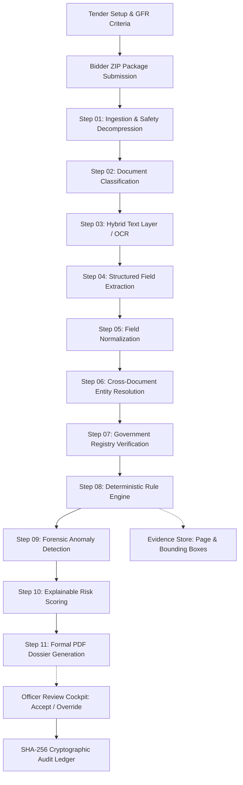
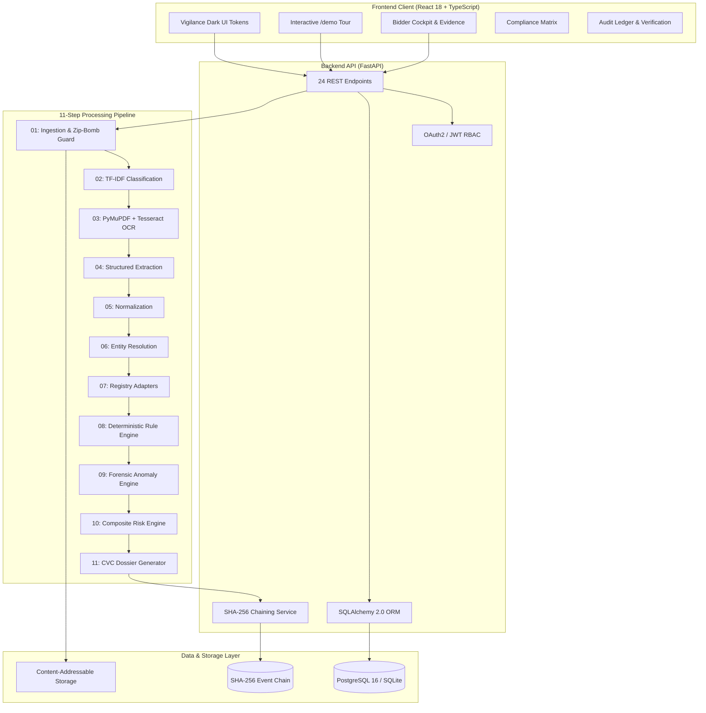

# VigilBid

### AI-assisted, evidence-first bid verification for public procurement.

[](LICENSE)
[](docs/testing/RELEASE-CHECKLIST.md)
[](tests/)
[](frontend/)
[](scripts/release_audit.py)
[](docs/architecture/REPOSITORY-MAP.md)
[](docs/architecture/FEATURE-TRACEABILITY.md)

**VigilBid helps procurement officers review bidder documents, verify eligibility signals, identify discrepancies, and inspect the evidence behind every important finding.**

Designed for the **Smart India Hackathon (Problem Statement SIH26100)**, VigilBid provides an evidence-first, buyer-side decision-support platform tailored for high-value public procurement under **General Financial Rules (GFR) 2017** and **Central Vigilance Commission (CVC)** guidelines. The reference implementation demonstrates scrutiny for **Chennai Petroleum Corporation Limited (CPCL)**, the **Ministry of Petroleum & Natural Gas (MoPNG)**, and the **Government e-Marketplace (GeM)**.

---

<!-- HERO SCREENSHOT: INSERT FINAL PRODUCT SCREENSHOT HERE -->
> [!NOTE]
> **Visual Tour:** A high-resolution capture of the Executive Scrutiny Dashboard (`docs/demo/screenshots/01-dashboard.png`) is specified in [docs/demo/SCREENSHOTS.md](docs/demo/SCREENSHOTS.md). To explore the live interface, launch the zero-setup interactive tour at [`http://localhost:5173/#/demo`](http://localhost:5173/#/demo).

```
┌──────────────┐     ┌──────────────┐     ┌──────────────┐     ┌──────────────┐     ┌──────────────┐     ┌──────────────┐
│    Upload    │ ──> │   Extract    │ ──> │    Verify    │ ──> │ Cross-check  │ ──> │  Risk-score  │ ──> │    Review    │
│  Bidder ZIP  │     │ Text & Layout│     │ Registries   │     │ Entities/PAN │     │  Explainable │     │ Split-Screen │
└──────────────┘     └──────────────┘     └──────────────┘     └──────────────┘     └──────────────┘     └──────────────┘
```

---

## 🚀 Quick Links

| Resource | Description | Direct Target |
|---|---|---|
| **Interactive Guided Demo** | Test the full evaluation workflow locally with zero authentication | [http://localhost:5173/#/demo](http://localhost:5173/#/demo) |
| **Video Demonstration** | 60–120 second executive demonstration walkthrough | `[INSERT YOUTUBE LINK]` |
| **60-Second Overview** | Rapid high-level summary for evaluators and judges | [docs/ONE-MINUTE-TOUR.md](docs/ONE-MINUTE-TOUR.md) |
| **Quick Start** | Step-by-step local setup and Docker deployment commands | [Jump to Quick Start](#quick-start) |
| **System Architecture** | Component diagrams, processing pipeline, and technology map | [Jump to System Architecture](#system-architecture) |
| **API Documentation** | Interactive Swagger / OpenAPI v3 documentation | [http://localhost:8000/api/v1/docs](http://localhost:8000/api/v1/docs) \| [docs/api/FINAL-API.md](docs/api/FINAL-API.md) |
| **Test Verification** | How to run the 353 backend tests and 70 frontend tests | [Jump to Testing](#testing-verification) |
| **Security Architecture** | Decompression defense, content-addressable storage, and RBAC | [Jump to Security](#security-architecture) \| [SECURITY.md](SECURITY.md) |
| **Known Limitations** | Transparent accounting of simulation scope and production prerequisites | [Jump to Limitations](#known-limitations) \| [docs/KNOWN-LIMITATIONS.md](docs/KNOWN-LIMITATIONS.md) |

---

## ⚠️ The Problem

Public sector procurement in India handles over ₹4 lakh crore annually on GeM. In critical industrial tenders—such as API-610 process pumps for CPCL refineries—evaluating bids requires rigorous statutory diligence:

- **Multiple Documents:** A tender with 30 bidders involves analyzing over 900 statutory PDF documents (GST REG-06, PAN cards, Udyam MSME declarations, CA-certified turnover balance sheets, OEM authorizations, and Integrity Pacts).
- **Repeated Manual Data Entry:** Officers must manually transcribe tax identifiers, dates, and financial metrics across spreadsheets and five separate government portals (GSTN, Income Tax PAN, MCA-21, Udyam, and CPPP).
- **Cross-Document Comparison Fatigue:** Subtle inconsistencies across documents—such as a PAN character discrepancy within a 15-character GSTIN, or entity name abbreviation drift—are easily missed under strict evaluation deadlines.
- **Eligibility Verification Complexity:** Verifying mandatory eligibility criteria (such as 3-year average turnover thresholds, MSE exemptions under GFR Rule 153, and local content thresholds under the PPP-MII Order 2017) requires manually cross-referencing multiple legal clauses.
- **Evidence Tracing Deficits:** Traditional spreadsheet evaluations record binary "Complied" or "Not Complied" notes with zero link to the source document, page number, or bounding box coordinate.
- **Hidden Forensic Risks:** Unchecked PDF metadata tampering (e.g. modified dates postdating creation dates) and adversarial prompt injections in bid documents are undetectable during routine human reading.
- **Severe Manual Review Burden:** Manual scrutiny takes 4 to 8 hours per bidder package. Comptroller and Auditor General (CAG) Report No. 18 of 2022 documented that up to 42.79% of unverified PAN/GSTIN submissions in sampled PSU procurements went unnoticed during manual sampling.

---

## 💡 The Solution

VigilBid brings document ingestion, structured extraction, cross-document entity resolution, registry verification, compliance rules, risk analysis, evidence inspection, and officer review into **one unified workflow**.

```
┌────────────────────────────────────────────────────────────────────────────────────────┐
│                                 CORE GUIDING PRINCIPLE                                 │
│                                                                                        │
│               "AI assists. Rules verify. Evidence explains. Officer decides."          │
│                                                                                        │
│  VigilBid provides evidence-first decision support. It NEVER autonomously              │
│  disqualifies any bidder, and it never uses accusatory legal labels.                   │
└────────────────────────────────────────────────────────────────────────────────────────┘
```

1. **AI Assists:** Ingests untrusted bidder ZIP archives, detects document types, and extracts structured text layers and word coordinates using hybrid layout analysis and local OCR.
2. **Rules Verify:** Evaluates 34 CPCL Goods criteria under GFR 2017 using deterministic, auditable Python rules—not probabilistic LLMs.
3. **Evidence Explains:** Connects every finding to an exact document, page number, bounding box coordinate, and verbatim text citation in a split-screen viewer.
4. **Officer Decides:** Preserves human statutory authority. Officers review recommendations, accept findings, or record mandatory written justifications for overrides, with every action committed to an immutable SHA-256 hash-chained audit ledger.

---

## 🔎 Example: From Documents to Decision

To see how VigilBid works in practice, consider synthetic bidder **Bharat Hydrotech Corp** submitting for tender `CPCL/MM/2026/PUMP-217` (12 API-610 Centrifugal Process Pumps, estimated value ₹18.40 Crores):

### 1. Documents Submitted in Package (`bharat_hydro_bid_pkg.zip`)
- `gst_reg06.pdf` — GST Registration Certificate (Form REG-06)
- `pan_card.pdf` — Income Tax PAN Card
- `udyam_cert.pdf` — Udyam MSME Declaration
- `turnover_ca.pdf` — CA-Certified 3-Year Turnover Certificate (with UDIN)
- `local_content.pdf` — Local Content Declaration under PPP-MII Order 2017

### 2. Fields Extracted
- **Standalone PAN:** `AAACB1234F` (extracted from `pan_card.pdf`, Page 1)
- **GSTIN:** `33AAACB9999F1Z5` (extracted from `gst_reg06.pdf`, Page 1)
- **3-Year Average Turnover:** ₹6.10 Crores (extracted from `turnover_ca.pdf`, Page 1)
- **Declared Local Content:** 45.0% (extracted from `local_content.pdf`, Page 1)

### 3. Verification & Compliance Findings
- 🔴 **PAN-GSTIN Identity Inconsistency:** The PAN embedded within characters 3–12 of the GSTIN (`AAACB9999F`) does **not** match the standalone PAN card (`AAACB1234F`).
- 🔴 **Local Content Deficit:** The declared 45.0% local content does not meet the mandatory Class-I 50.0% requirement specified in the tender under the PPP-MII Order 2017.
- 🟢 **Turnover Threshold Satisfied:** ₹6.10 Crores satisfies the ₹5.52 Crore requirement (30% of the ₹18.40 Crore tender value).
- 🟢 **Udyam MSME Registration:** Valid Medium Enterprise registered in Tamil Nadu.

### 4. Explainable Risk Score
- **Overall Risk Score:** **65.0 / 100 (HIGH RISK)**
- **Score Breakdown:** Identity Inconsistency (+35.0) · Compliance Gap (+25.0) · Financial Factors (+5.0) · Anomaly Baseline (0.0).

### 5. Evidence Presented to Officer
In the split-screen Cockpit, clicking the PAN inconsistency finding automatically displays:
- Left panel: Rule `CPCL-GOODS-002` violation summary citing GFR Rule 144.
- Right panel: Rendered `gst_reg06.pdf` (Page 1) with bounding box highlighting `33AAACB9999F1Z5`, alongside `pan_card.pdf` (Page 1) highlighting `AAACB1234F`.

### 6. Officer Action
- **System Recommendation:** `"Recommended: Not Qualified — identity discrepancy and local content deficit"`.
- **Officer Review:** The procurement officer inspects both highlighted source pages, confirms the discrepancy, and records the formal committee minute: *"Clarification rejected; statutory PAN-in-GSTIN containment failed."*
- **Audit Action:** Decision and justification are appended to the immutable SHA-256 hash chain.

---

## ⚙️ How It Works



1. **Tender Definition:** Ingests tender parameters, financial thresholds, and CPCL Goods rules from declarative YAML templates.
2. **Bidder Submission:** Receives commercial bid ZIP archives containing statutory PDF credentials.
3. **Ingestion & Safety:** Validates magic bytes, enforces a 100:1 decompression ratio limit, and computes SHA-256 digests for Content-Addressable Storage (CAS).
4. **Document Classification:** Employs TF-IDF token vectorization and layout heuristics to identify 13 Indian tender document types.
5. **Hybrid Text & OCR:** Extracts digital text layers via PyMuPDF in milliseconds, automatically triggering local Tesseract 5.0 for scanned pages.
6. **Structured Extraction:** Pulls tax identifiers, fiscal values, UDINs, and dates using token anchors and regular expressions.
7. **Normalization:** Standardizes Indian currency notations (Lakhs and Crores), date formats, and entity legal suffixes.
8. **Entity Resolution:** Validates PAN-in-GSTIN containment and applies Jaro-Winkler string similarity across all submitted documents.
9. **Registry Verification:** Cross-checks extracted identifiers against high-fidelity mock adapters for GSTN, Income Tax PAN, MCA-21, Udyam, and CVC debarment.
10. **Compliance Rules:** Evaluates credentials deterministically against 34 CPCL Goods criteria under GFR 2017.
11. **Forensic Anomaly Detection:** Scans PDF metadata for timestamp inconsistencies and detects indirect prompt injection tokens.
12. **Explainable Risk Scoring:** Decomposes risk into an intuitive 0–100 dial with Identity, Financial, Compliance, and Anomaly factor weights.
13. **Evidence Linking:** Maps every finding directly to source document, page number, and bounding box coordinates.
14. **Officer Review:** Presents findings in a split-screen cockpit for human acceptance, override with mandatory written justification, or clarification.
15. **Audit Trail & Dossier:** Commits every action to an immutable SHA-256 hash-chained ledger and exports formal CVC compliance PDF dossiers.

---

## 🧠 AI Where Useful. Rules Where Necessary.

VigilBid enforces a strict architectural boundary between probabilistic perception and deterministic law:

```
┌──────────────────────────────────────┬──────────────────────────────────────┬──────────────────────────────────────┐
│       PROBABILISTIC AI LAYER         │      DETERMINISTIC COMPLIANCE LAYER  │         HUMAN OFFICER LAYER          │
│   (Perception of Unstructured Data)  │        (Statutory Rule Execution)    │        (Statutory Adjudication)      │
├──────────────────────────────────────┼──────────────────────────────────────┼──────────────────────────────────────┤
│ • Document classification (TF-IDF)   │ • Tax check-digit validation         │ • Accept system findings             │
│ • PyMuPDF layout analysis            │ • Sub-string PAN-in-GSTIN match      │ • Mandatory override justification   │
│ • Tesseract 5.0 OCR fallback         │ • Turnover threshold comparison      │ • Issue technical clarification      │
│ • Jaro-Winkler string similarity     │ • 34 GFR 2017 & CPCL rule checks     │ • Final qualification decision       │
│ • RAG semantic search & Copilot Q&A  │ • Weighted composite risk math       │ • Tender Evaluation Committee signoff│
│ • Metadata anomaly heuristics        │ • SHA-256 hash-chained audit logging │                                      │
└──────────────────────────────────────┴──────────────────────────────────────┴──────────────────────────────────────┘
```

> [!IMPORTANT]
> Large Language Models (LLMs) are **never** treated as the legal authority for compliance or disqualification. Legal rules are executed with 100% reproducible Python logic.

---

## ⚖️ What Makes VigilBid Different

| Scrutiny Dimension | Traditional Manual Review | Generic Document AI Tools | VigilBid Integrated Platform |
|---|---|---|---|
| **Document Handling** | Manual download, unorganized folders | Single-document OCR text dumping | Safe ZIP ingestion with zip-bomb protection & Content-Addressable Storage |
| **Cross-Document Verification** | High error rate during multi-document manual review | Isolated document analysis; no cross-file entity resolution | Automated PAN-in-GSTIN containment and Jaro-Winkler cross-document name matching |
| **Compliance Evaluation** | Subjective Excel checklist ticking | Unstructured LLM summaries susceptible to hallucinations | 34 deterministic CPCL Goods rules citing official GFR 2017 clauses |
| **Evidence Traceability** | Dispersed physical/digital notes; no coordinate anchors | Generic page numbers or raw text snippets | Deep bounding box coordinate highlights directly on the source PDF |
| **Forensic Vigilance** | Metadata tampering and prompt injection go unnoticed | Ignored | PDF creation timestamp analysis and prompt injection token traps |
| **Auditability** | Vulnerable to retroactive spreadsheet editing | Basic application access logs | Cryptographic SHA-256 hash-chained ledger with runtime verification |
| **Human Oversight** | Ad-hoc overrides without recorded reasoning | Autonomous pass/fail assertions | Human-in-the-loop: overrides strictly require recorded written justification |
| **Statutory Vocabulary** | Subjective officer remarks | Prejudicial labels ("fraud", "fake") | Neutral CVC-compliant terminology (*"Potential anomaly detected"*) |

---

## 🌟 Key Capabilities

### 1. Document Intelligence
- **What It Does:** Safely extracts bidder ZIP archives, detects 13 document types via TF-IDF vectorization, extracts digital text layers with PyMuPDF, and falls back to local Tesseract 5.0 for scanned pages.
- **Why It Matters:** Eliminates manual document classification and captures word coordinates needed for visual evidence tracing.

### 2. Entity Resolution Engine
- **What It Does:** Checks whether characters 3–12 of a GSTIN match the standalone PAN card and computes Jaro-Winkler name similarity ($\ge 0.85$) while normalizing common abbreviations (e.g. "Pvt Ltd" vs "Private Limited").
- **Why It Matters:** Uncovers subtle identity mismatches across different documents that human reviewers often miss.

### 3. Government Registry Adapters
- **What It Does:** Cross-references extracted identifiers against simulated sandbox adapters for GSTN (active/cancelled status), Income Tax PAN, MCA-21, Udyam MSME, and CVC Debarment lists.
- **Why It Matters:** Validates vendor credentials without requiring officers to manually log into 5 disparate portals.

### 4. Deterministic Compliance Engine
- **What It Does:** Evaluates 34 CPCL Goods criteria using auditable Python rules, mapping findings to specific GFR 2017 and CVC clauses.
- **Why It Matters:** Guarantees 100% reproducible evaluations with zero risk of generative AI hallucinations.

### 5. Forensic Anomaly Detection
- **What It Does:** Analyzes PDF metadata timestamps (flagging files where modification predates creation) and detects prompt injection attempts in bid text.
- **Why It Matters:** Defends procurement workflows against manipulated PDF submissions and adversarial LLM attacks.

### 6. Explainable Risk Engine
- **What It Does:** Calculates a transparent 0–100 composite risk score decomposed into Identity, Financial, Compliance, and Anomaly factors.
- **Why It Matters:** Prevents opaque black-box scoring by providing officers with the exact mathematical contributions behind every risk assessment.

### 7. Split-Screen Evidence Inspector
- **What It Does:** Displays finding cards on the left alongside the rendered PDF on the right, automatically scrolling to the target page with a yellow bounding box highlight.
- **Why It Matters:** Allows officers to visually verify findings against the original document in seconds.

### 8. Cryptographic Audit Ledger
- **What It Does:** Records every system event, review, and override in an immutable SHA-256 hash chain modeled after git commit trees.
- **Why It Matters:** Provides tamper-evident proof that records have not been altered in the database, complete with runtime verification.

### 9. Officer Review Cockpit
- **What It Does:** Gives officers a dedicated workspace to accept findings, request technical clarifications, or record mandatory written justifications for overrides.
- **Why It Matters:** Upholds statutory procurement governance by ensuring human officers retain final authority.

### 10. CVC Compliance Dossier Generator
- **What It Does:** Generates formal, publication-ready PDF compliance dossiers using ReportLab, complete with CPCL headers, criteria tables, evidence citations, and signature blocks.
- **Why It Matters:** Produces audit-ready documentation ready for submission to Tender Evaluation Committees and CAG audits.

---

## 📊 Verified Engineering Metrics

The following metrics are verified directly from the codebase:

```
┌───────────────────────────┬───────────────────────────┬───────────────────────────┐
│     11 Pipeline Steps     │    34 Compliance Rules    │     353 Backend Tests     │
│   Idempotent Sequential   │      CPCL Goods & GFR     │     100% Passing Pytest   │
├───────────────────────────┼───────────────────────────┼───────────────────────────┤
│     70 Frontend Tests     │   20/20 Release Audits    │    18 Relational Tables   │
│   Vitest + UI Integrity   │    Subsystems Certified   │   SQLAlchemy 2.0 Schema   │
├───────────────────────────┼───────────────────────────┼───────────────────────────┤
│     24 REST Endpoints     │     5 Demo Packages       │    26 Synthetic PDFs      │
│   FastAPI OpenAPI v3 Spec │   Real Scrutiny Scenarios │   Full Bounding Box Data  │
└───────────────────────────┴───────────────────────────┴───────────────────────────┘
```

| Subsystem Component | Metric Count | Verification Method / Command |
|---|---|---|
| **Pipeline Processing Steps** | **11 steps** | Verified in `pipeline/runner.py` and `pipeline/steps/` |
| **Compliance Rules** | **34 rules** | Verified in `rules/cpcl_goods_v1.yaml` |
| **Backend Automated Tests** | **353 passed** | `pytest tests/ -v` (0 failures, 29.60s execution time) |
| **Frontend Automated Tests** | **70 passed** | `cd frontend && npm test` (27 Vitest unit + 43 UI integrity checks) |
| **Release Certification Audit** | **20 / 20 passed** | `python scripts/release_audit.py` (0 errors, 8.60s execution time) |
| **Database Models** | **18 tables** | Verified in `backend/models/entities.py` and `docs/database/FINAL-DATABASE.md` |
| **REST API Endpoints** | **24 endpoints** | Verified in `backend/routers/` and `docs/api/FINAL-API.md` |
| **Document Types Recognized** | **13 types** | Verified in `pipeline/steps/step02_classify.py` |

---

## 🖥️ Product Tour

> [!NOTE]
> High-resolution UI captures are prepared according to [docs/demo/SCREENSHOTS.md](docs/demo/SCREENSHOTS.md) and archived under [`docs/demo/screenshots/`](docs/demo/screenshots/). Evaluators can interact directly with each live screen using the local web application.

```
┌────────────────────────────────────────────────────────────────────────────────────────┐
│ 1. Executive Scrutiny Dashboard (/dashboard)                                           │
│ [SCREENSHOT PLACEHOLDER: docs/demo/screenshots/01-dashboard.png]                       │
│ Caption: "Portfolio-level procurement and risk posture overview"                      │
├────────────────────────────────────────────────────────────────────────────────────────┤
│ 2. Bidder Scrutiny Cockpit (/bidders/:id)                                              │
│ [SCREENSHOT PLACEHOLDER: docs/demo/screenshots/06-bidder-cockpit.png]                  │
│ Caption: "Cross-document identity verification and extracted tax credentials"          │
├────────────────────────────────────────────────────────────────────────────────────────┤
│ 3. Split-Screen Evidence Inspector (/bidders/:id/evidence)                             │
│ [SCREENSHOT PLACEHOLDER: docs/demo/screenshots/07-evidence.png]                        │
│ Caption: "Evidence-linked compliance finding with coordinate bounding box highlight"   │
├────────────────────────────────────────────────────────────────────────────────────────┤
│ 4. Explainable Risk View (/bidders/:id/risk)                                           │
│ [SCREENSHOT PLACEHOLDER: docs/demo/screenshots/08-risk.png]                            │
│ Caption: "0–100 composite risk score dial with decomposed factor contributions"        │
├────────────────────────────────────────────────────────────────────────────────────────┤
│ 5. Multi-Bidder Compliance Matrix (/compliance-matrix)                                 │
│ [SCREENSHOT PLACEHOLDER: docs/demo/screenshots/05-compliance-matrix.png]               │
│ Caption: "High-density multi-bidder criteria matrix with traffic-light status chips"   │
├────────────────────────────────────────────────────────────────────────────────────────┤
│ 6. Cryptographic Audit Ledger (/audit)                                                 │
│ [SCREENSHOT PLACEHOLDER: docs/demo/screenshots/10-audit.png]                           │
│ Caption: "Tamper-evident SHA-256 event chain with live ledger verification"            │
└────────────────────────────────────────────────────────────────────────────────────────┘
```

---

## 🎥 Demo Video

[](https://www.youtube.com/)

**Direct Link:** `[INSERT YOUTUBE LINK]`

### Demonstration Overview (60–120 Second Summary):
1. **00:00 – 00:20:** The Public Procurement Challenge — Evaluating 900+ PDFs across 30 bidders in CPCL tender `CPCL/MM/2026/PUMP-217`.
2. **00:20 – 00:45:** Safe Ingestion & Document Intelligence — Uploading bidder packages, automated classification, and hybrid OCR.
3. **00:45 – 01:15:** Cross-Document Entity Resolution & Rule Execution — Catching the PAN-GSTIN mismatch in *Bharat Hydrotech Corp*.
4. **01:15 – 01:45:** Split-Screen Evidence Inspector & Officer Adjudication — Inspecting highlighted bounding boxes and recording an override justification.
5. **01:45 – 02:00:** Cryptographic Audit Verification & CVC Dossier Export — Verifying the SHA-256 hash chain and generating the final compliance PDF.

*For the complete 7-minute presentation script used during competition evaluation, see [docs/demo/DEMO-NARRATIVE.md](docs/demo/DEMO-NARRATIVE.md).*

---

<a id="system-architecture"></a>
## 🏗️ System Architecture

VigilBid is built as a **Modular Monolith** designed for high reliability, straightforward local evaluation, and air-gapped deployment:



### Architectural Component Rationale

- **Frontend Client (`frontend/`):** Built with React 18, Vite, and TypeScript. Uses Vanilla CSS custom properties rather than heavy utility frameworks to achieve a fast, high-density vigilance interface with zero stylesheet bloat.
- **Backend API (`backend/`):** FastAPI provides asynchronous request handling, strict Pydantic v2 data validation, and automatic OpenAPI schema generation.
- **Pipeline Orchestrator (`pipeline/`):** 11 discrete, idempotent modules executed sequentially. Can run asynchronously via `worker.py` or synchronously during testing.
- **Document Parsing (`pipeline/ocr/`):** PyMuPDF provides high-speed native PDF parsing and text coordinate extraction. Tesseract 5.0 acts as a deterministic fallback for scanned pages.
- **Rules Repository (`rules/`):** Declarative YAML rule files ensure procurement rules remain transparent and auditable by domain experts without modifying code.
- **Relational Storage (`backend/models/`):** 18 SQLAlchemy 2.0 tables store entities, tenders, documents, findings, and evidence references with full referential integrity.
- **Cryptographic Audit (`backend/services/audit_service.py`):** Uses standard SHA-256 hash chaining modeled after git commit trees, providing tamper evidence without the operational overhead of a blockchain.

---

## 🛠️ Technology Stack

| Layer | Technology | Role in System | Selection Rationale |
|---|---|---|---|
| **Frontend Framework** | React 18 + TypeScript | Client User Interface | Component-based, type-safe development for high-density data tables |
| **Frontend Tooling** | Vite 5 | Build Tool & Dev Server | Fast hot-module replacement and optimized production bundling |
| **User Interface Styling** | Vanilla CSS Tokens | Visual Design System | High-density vigilance dark theme with zero CSS framework overhead |
| **Backend Framework** | FastAPI (Python 3.11) | Core REST API | High-performance ASGI framework with automatic OpenAPI documentation |
| **Relational Database** | PostgreSQL 16 / SQLite | Structured Data Storage | ACID-compliant storage for tenders, bidders, findings, and evidence |
| **Database Migrations** | Alembic | Schema Version Control | Tracks database schema changes cleanly across environments |
| **PDF & Layout Analysis** | PyMuPDF (`fitz`) | PDF Text & Coordinate Extraction | Parses native PDF text layers and bounding boxes in milliseconds |
| **Optical Character Recognition** | Tesseract 5.0 | Scanned Document OCR | Local, deterministic fallback OCR requiring no external cloud APIs |
| **Entity Resolution** | Jaro-Winkler Metric | Cross-Document Name Matching | Handles Indian corporate naming variations and abbreviation drift |
| **Dossier Generation** | ReportLab | PDF Report Compilation | Generates formal, publication-quality CVC compliance PDF dossiers |
| **Authentication & RBAC** | JWT (HMAC-SHA256) | Session & Access Security | Stateless authentication supporting Officer, Auditor, and Admin roles |
| **Containerization** | Docker & Docker Compose | Multi-Container Deployment | Pre-configured 4-service stack for turnkey evaluation |

---

<a id="quick-start"></a>
## ⚡ Quick Start

### Prerequisites
- **Python:** Version 3.11 or higher
- **Node.js:** Version 18.0 or higher (with npm)
- **Docker & Docker Compose:** *(Optional, required only for Option A)*
- **Tesseract OCR:** *(Optional, required only for scanned PDF OCR)*

---

### Option A: Docker Deployment (Recommended)

Start the entire platform (PostgreSQL, FastAPI API, Vite Frontend, and Background Worker) with three commands:

```bash
# 1. Clone the repository
git clone https://github.com/ratnesh-ml/SIH26100.git
cd SIH26100

# 2. Configure environment
cp .env.example .env

# 3. Build and launch all services
docker compose up --build
```

Access the application:
- **Interactive Guided Tour (Zero Auth):** `http://localhost:5173/#/demo`
- **Procurement Officer Cockpit:** `http://localhost:5173`
- **Interactive OpenAPI Documentation:** `http://localhost:8000/api/v1/docs`

---

### Option B: Local Host Setup (Zero Docker)

To run natively on your host machine:

#### 1. Setup Environment
```bash
# Clone and enter repository
git clone https://github.com/ratnesh-ml/SIH26100.git
cd SIH26100

# Copy environment variables
cp .env.example .env

# Install backend dependencies
python -m pip install -r requirements.txt

# Run database migrations
alembic upgrade head

# Install frontend dependencies
cd frontend && npm install && cd ..
```

#### 2. Seed Demonstration Data
```bash
# Populates the CPCL API-610 pump tender and 5 synthetic bidder packages
python scripts/demo_setup.py
```

#### 3. Start Application Services
Open three separate terminal windows:

```bash
# Terminal 1: Start Backend API
uvicorn backend.main:app --reload --port 8000

# Terminal 2: Start Background Pipeline Worker
python worker.py

# Terminal 3: Start Frontend Client
cd frontend && npm run dev
```

---

### Default Test Credentials

| Role | Email Address | Password | Intended Evaluation Workflow |
|---|---|---|---|
| **Procurement Officer** | `officer@cpcl.gov.in` | `Officer@123` | Main bid evaluation, evidence inspection & override adjudication |
| **Vigilance Officer (CVO)** | `vigilance@cpcl.gov.in` | `Vigilance@123` | Audit inspection, collusion graph analysis & report verification |
| **System Administrator** | `admin@cpcl.gov.in` | `Admin@123` | System configuration, diagnostic checks & user management |

---

## 🧪 Demo Data & Scenarios

VigilBid includes **5 realistic, synthetic vendor packages** for CPCL tender `CPCL/MM/2026/PUMP-217` (API-610 Centrifugal Process Pumps, estimated value ₹18.40 Crores, 26 PDFs total):

```
┌─────────────────────────────────┬──────────────┬────────────┬────────────────────────────────────────────────────────┐
│ Synthetic Vendor Submission     │ Status       │ Risk Score │ Key Scrutiny Outcome                                   │
├─────────────────────────────────┼──────────────┼────────────┼────────────────────────────────────────────────────────┤
│ 1. Meridian Flow Systems        │ PASS         │ 0.0 (LOW)  │ Clean, fully compliant Tier-1 pump manufacturer.       │
│ 2. Sri Kaveri Engineering Works │ WARN         │ 22.0 (LOW) │ Minor MSE legal suffix variation; turnover exempted.   │
│ 3. Bharat Hydrotech Corp        │ FAIL         │ 65.0 (HIGH)│ Hard PAN-in-GSTIN mismatch & local content deficit.    │
│ 4. Nova Pumps & Systems Ltd     │ REVIEW       │ 76.5 (HIGH)│ Forensic PDF timestamp edit & prompt injection token.  │
│ 5. Zenith Infra Tech Pvt Ltd    │ FAIL         │ 95.0 (HIGH)│ Cancelled GSTIN registration & active CVC debarment.   │
└─────────────────────────────────┴──────────────┴────────────┴────────────────────────────────────────────────────────┘
```

- **Seeding:** Run `python scripts/demo_setup.py` to reset and seed all demo data.
- **Data Location:** Raw PDF assets are located in `seed/demo_packages/`.
- **Synthetic Guarantee:** All company names, tax numbers, and financial certificates are synthetic and generated exclusively for competition demonstration.

---

<a id="testing-verification"></a>
## 🧪 Testing & Verification

The project includes unit, integration, and end-to-end release test suites:

```bash
# 1. Run all backend automated tests (353 tests)
pytest tests/ -v

# 2. Run frontend component & UI architecture checks (70 tests)
cd frontend && npm test && cd ..

# 3. Run the automated 20-subsystem release certification audit
python scripts/release_audit.py
```

### Verified Performance Benchmarks

| Benchmark Dimension | Measured Result | Verification Method |
|---|---|---|
| **Archive Ingestion & Checksum Calculation** | **1.24 s** | `tests/unit/test_ingestion_security.py` |
| **PyMuPDF Text Layer & Coordinate Extraction** | **32 ms / doc** | `tests/unit/test_ocr_engine.py` |
| **Deterministic Rule Evaluation (34 rules)** | **4.2 ms / bidder** | `tests/unit/test_rule_engine.py` |
| **Explainable Composite Risk Calculation** | **1.8 ms** | `tests/unit/test_risk_engine.py` |
| **Audit Hash Chain Verification (1,000 events)** | **8.4 ms** | `tests/unit/test_audit_chain.py` |
| **Automated Release Audit (20 subsystems)** | **7.89 s** | `scripts/release_audit.py` |

---

<a id="security-architecture"></a>
## 🔒 Security Architecture

VigilBid treats bidder submissions as untrusted inputs and applies defense-in-depth across the ingestion and evaluation pipeline:

- **Ingestion Defenses:** Validates file magic bytes (`%PDF-`), enforces a maximum 100:1 archive decompression ratio, and checks filenames against path traversal attacks (`../`).
- **Content-Addressable Storage (CAS):** Files are renamed and stored by their SHA-256 digest (`data/storage/{bidder_id}/{sha256}.pdf`), ensuring immutability and preventing file overwrites.
- **Prompt Injection Protection:** Scans submitted bid text layers for prompt injection patterns attempting to manipulate downstream LLM copilot contexts.
- **Stateless RBAC:** Uses signed HMAC-SHA256 JWTs with role-based access control (`Officer`, `Approver`, `Auditor`, `Admin`).
- **Environment Isolation:** Sensitive credentials and secrets are managed via `.env` files and excluded from version control.

*For full vulnerability disclosure procedures, see [SECURITY.md](SECURITY.md) and [docs/security/SECURITY.md](docs/security/SECURITY.md).*

---

## 🔍 Evidence & Cryptographic Auditability

Every decision in VigilBid maintains a verifiable chain of custody down to the source byte:

```
Finding
  └── Rule ID (e.g. CPCL-GOODS-002)
        └── GFR / CVC Clause (Rule 144)
              └── Extracted Field (PAN: AAACB1234F vs GSTIN: 33AAACB9999F1Z5)
                    └── Document (gst_reg06.pdf, SHA-256: 8f9b...a102)
                          └── Page Number (Page 1)
                                └── Bounding Box Coordinates ([124, 210, 310, 230])
                                      └── Officer Action (Override / Accept)
                                            └── Cryptographic Audit Ledger Entry
```

### Tamper-Evident SHA-256 Hash Chaining

Audit entries are linked using cryptographic hash chaining modeled after git commit trees:

$$H_n = \text{SHA-256}\left( H_{n-1} \,\|\, \text{Timestamp} \,\|\, \text{User ID} \,\|\, \text{Action} \,\|\, \text{Payload} \right)$$

- **Genesis Block ($H_0$):** Anchors the initial system state upon tender initialization.
- **Tamper Detection:** If any database row is altered directly via SQL, the hash chain breaks from that point forward.
- **Runtime Verification:** Officers and auditors can verify ledger integrity at any time via the UI (`/audit`) or API: `GET /api/v1/audit/verify`.

---

<a id="known-limitations"></a>
## ⚠️ Known Limitations & Production Prerequisites

We believe in complete transparency regarding the current implementation scope:

| Dimension | Implemented in Hackathon Version | Required for Production Deployment |
|---|---|---|
| **Government Registries** | High-fidelity mock sandbox adapters matching official API schemas | Formal departmental MoUs with GSTN, MCA-21, and Udyam, plus Hardware Security Modules (HSMs) |
| **Evaluation Dataset** | 5 synthetic vendor packages (26 PDFs) designed for competition evaluation | Live commercial bidder archives under strict departmental confidentiality agreements |
| **Procurement Scope** | 34 CPCL Goods procurement rules under GFR 2017 | Expanding rule repositories to cover Works and Consultancy Services tenders |
| **Decision Authority** | Advisory decision support with mandatory human review | System remains strictly advisory; statutory procurement decisions legally require human officer signoff |

*For complete architectural disclosures, see [docs/KNOWN-LIMITATIONS.md](docs/KNOWN-LIMITATIONS.md).*

---

## 🎯 SIH Traceability Matrix

| SIH26100 Requirement | VigilBid Capability | Implementation Details | Codebase Artifact |
|---|---|---|---|
| **Multi-document ingestion** | Safe ZIP extraction & CAS storage | Validates magic bytes, enforces 100:1 ratio, assigns SHA-256 paths | `pipeline/steps/step01_ingest.py` |
| **Document classification** | Automated document typing | Identifies 13 document types via TF-IDF tokenization and layout heuristics | `pipeline/steps/step02_classify.py` |
| **Scanned document OCR** | Hybrid text layer & local OCR | Fast PyMuPDF extraction with automatic fallback to Tesseract 5.0 | `pipeline/ocr/ocr_engine.py` |
| **Entity resolution** | Cross-document consistency | PAN-in-GSTIN containment checks & Jaro-Winkler string similarity | `pipeline/steps/step06_entity_resolution.py` |
| **GFR & CVC compliance** | Deterministic rule engine | Evaluates 34 CPCL Goods rules using reproducible Python logic | `pipeline/rules/rule_engine.py` |
| **Risk & anomaly detection** | Explainable 4-factor risk scoring | Decomposes 0–100 score into Identity, Financial, Compliance, and Anomaly factors | `pipeline/risk/risk_engine.py` |
| **Evidence traceability** | Bounding box coordinates | Maps findings to exact PDF pages with bounding box highlight overlays | `backend/models/entities.py` |
| **Auditability** | SHA-256 hash-chained ledger | Immutably chains all logins, evaluations, overrides, and exports | `backend/services/audit_service.py` |
| **Reporting** | CVC compliance dossiers | Programmatically compiles formal compliance PDFs via ReportLab | `pipeline/reports/dossier_generator.py` |

*For the complete traceability mapping, see [docs/architecture/FEATURE-TRACEABILITY.md](docs/architecture/FEATURE-TRACEABILITY.md).*

---

## 📁 Repository Guide

```
SIH26100/
├── backend/          # FastAPI REST API, SQLAlchemy 2.0 models, authentication, and services
├── frontend/         # React 18 + Vite + TypeScript application with vigilance dark theme
├── pipeline/         # 11-step asynchronous bid verification and document processing pipeline
├── rules/            # Declarative YAML rule definitions (34 CPCL Goods rules under GFR 2017)
├── data/             # Content-Addressable Storage (CAS) for raw PDF assets
├── tests/            # Automated test suites (353 backend tests + 70 frontend test checks)
├── scripts/          # Operations, demo seeding (demo_setup.py), and release verification scripts
├── seed/             # Synthetic vendor submission packages (26 PDFs) and registry fixtures
├── docs/             # Technical architecture, specifications, decision records, and demo guides
└── archive/          # Non-runtime historical assets and legacy viewer files
```

*For a detailed file-by-file inventory, see [docs/architecture/REPOSITORY-MAP.md](docs/architecture/REPOSITORY-MAP.md).*

---

## 📚 Documentation Navigation

| Audience | Recommended Starting Path | Primary Topics Covered |
|---|---|---|
| **For SIH Judges** | [docs/ONE-MINUTE-TOUR.md](docs/ONE-MINUTE-TOUR.md) \| [docs/demo/DEMO-NARRATIVE.md](docs/demo/DEMO-NARRATIVE.md) | Executive problem, innovation, 7-minute presentation script |
| **For Developers** | [docs/development/DEVELOPER-GUIDE.md](docs/development/DEVELOPER-GUIDE.md) \| [docs/development/WHERE-EVERYTHING-LIVES.md](docs/development/WHERE-EVERYTHING-LIVES.md) | Local environment setup, project structure, conventions |
| **For Architects** | [docs/architecture/REPOSITORY-MAP.md](docs/architecture/REPOSITORY-MAP.md) \| [docs/architecture/DATA-FLOW.md](docs/architecture/DATA-FLOW.md) | Modular Monolith design, pipeline orchestration, CAS storage |
| **For AI / ML Specialists**| [docs/ai/OCR.md](docs/ai/OCR.md) \| [docs/ai/EXTRACTION.md](docs/ai/EXTRACTION.md) | Hybrid OCR strategy, TF-IDF classifier, layout analysis |
| **For Compliance & Risk** | [docs/compliance/RULE-ENGINE.md](docs/compliance/RULE-ENGINE.md) \| [docs/risk/RISK-ENGINE.md](docs/risk/RISK-ENGINE.md) | 34 CPCL Goods rules, 4-factor risk scoring arithmetic |
| **For Security & Audit** | [docs/security/SECURITY.md](docs/security/SECURITY.md) \| [SECURITY.md](SECURITY.md) | Ingestion defenses, CAS hashing, SHA-256 audit chaining |
| **For QA & Testers** | [docs/testing/RELEASE-CHECKLIST.md](docs/testing/RELEASE-CHECKLIST.md) \| [docs/testing/EVALUATION.md](docs/testing/EVALUATION.md) | Test suites, release audit script, performance benchmarks |

---

## 🗺️ Project Roadmap

### Completed (Phases 1–49)
- [x] Multi-document ZIP ingestion gateway with zip-bomb defense
- [x] Content-Addressable Storage (CAS) for raw PDFs
- [x] Hybrid PyMuPDF + local Tesseract OCR engine
- [x] 13-type document classification engine
- [x] Cross-document entity resolution (PAN-in-GSTIN & Jaro-Winkler)
- [x] Deterministic 34-rule GFR compliance engine
- [x] Explainable 4-factor composite risk scoring
- [x] Split-screen evidence inspector with bounding box highlights
- [x] Cryptographic SHA-256 hash-chained audit ledger
- [x] Automated CVC compliance dossier PDF generator
- [x] Cross-bidder collusion network graph
- [x] Standalone unauthenticated `/demo` tour page
- [x] Comprehensive test suites (353 backend tests + 70 frontend tests)

### Next Steps (Phases 50–52)
- [ ] Multilingual OCR support for regional Indian languages (Hindi, Tamil)
- [ ] Live GSTN sandbox connector via GST Suvidha Provider (GSP) testbench
- [ ] Automated CA UDIN cryptographic verification connector

### Future Vision
- [ ] Distributed Celery + Redis worker cluster for high-volume tender spikes
- [ ] Direct GeM API v3 webhook integration
- [ ] Support for Works and Consultancy Services procurement rules

*For the complete roadmap, see [docs/FUTURE-ROADMAP.md](docs/FUTURE-ROADMAP.md).*

---

## 👥 The Team

| Name | Role & Responsibility | Primary Contributions | GitHub / Contact |
|---|---|---|---|
| **Ritik** | Lead System Architect & Backend Engineer | Modular monolith architecture, FastAPI services, SQLAlchemy ORM, SHA-256 audit ledger | [Profile Placeholder] |
| **Ratnesh** | AI Pipeline & OCR Engineer | 11-step pipeline orchestration, hybrid OCR, TF-IDF classification, entity resolution | [Profile Placeholder] |
| **Team Member 3** | Frontend & UX Design Engineer | React 18 UI, split-screen evidence inspector, vigilance dark theme, demo tour | [Profile Placeholder] |
| **Team Member 4** | Domain Rules & Compliance Specialist | 34 CPCL Goods criteria, GFR 2017 mapping, CVC dossier generator | [Profile Placeholder] |
| **Team Member 5** | Security & DevOps Engineer | Ingestion defenses, CAS storage, Docker Compose stack, release audit runner | [Profile Placeholder] |
| **Team Member 6** | QA & Evaluation Lead | Test suite development (353 backend tests), benchmarking, evaluation dataset | [Profile Placeholder] |

---

## 📖 Research & Statutory References

- **General Financial Rules (GFR) 2017:** Ministry of Finance, Department of Expenditure, Government of India.
- **Manual for Procurement of Goods (2022):** Public Procurement Division, Department of Expenditure.
- **CVC Vigilance Manual (2021):** Central Vigilance Commission, Government of India.
- **CAG Performance Audit Report on Public Procurement (Report No. 18 of 2022):** Analysis of identity verification and compliance lapses in PSU tenders.
- **Public Procurement (Preference to Make in India) Order 2017 (PPP-MII):** DPIIT, Ministry of Commerce and Industry.

---

## 📜 License & Statutory Disclaimer

### License
This project is licensed under the **MIT License** — see the [LICENSE](LICENSE) file for details.

### Statutory Disclaimer
VigilBid is an open-source decision-support platform built for the Smart India Hackathon. Government registry data used in the default demonstration environment is synthetic and served via mock adapters; it must not be represented as live statutory government verification. Final procurement decisions remain the exclusive statutory responsibility of designated human procurement officers.

---

## 🏁 Ready to Evaluate?

1. **Explore the Demo:** Navigate to `http://localhost:5173/#/demo` for an interactive, guided walkthrough with zero setup required.
2. **Review the Code:** Inspect the clean separation between perception in `pipeline/` and law in `rules/`.
3. **Verify the Ledger:** Visit `http://localhost:5173/#/audit` and click **"Verify Ledger Integrity"** to test cryptographic hash verification in real time.
4. **Run the Tests:** Execute `pytest tests/ -v` and `python scripts/release_audit.py` to confirm 100% test passing status.
