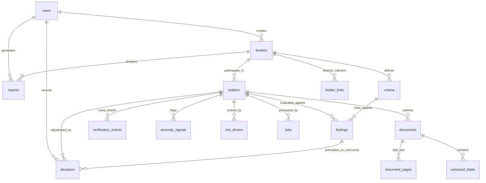

# VigilBid (SIH26100) — PostgreSQL Database Schema & Architecture

**Database Engine:** PostgreSQL 16 (Relational + JSONB + UUID)  
**ORM & Migration:** SQLAlchemy 2.0 + Alembic  
**Target Compliance:** GFR 2017, CVC Guidelines, IT Act 2000 (Section 65B Auditability)

---

## 1. Executive Summary & Philosophy

The VigilBid data model is engineered specifically for **two-bid public procurement evaluation** at Chennai Petroleum Corporation Limited (CPCL). It bridges noisy, unstructured multi-page PDFs (bids, certificates, financial statements) to a deterministic, tamper-evident evaluation record.

### Core Architectural Guarantees
1. **Decision Support, Never Autonomous Disqualification:** Evaluation outcomes in `findings` and `bidders` are recommendations (`PASS`, `WARN`, `REVIEW`, `FAIL`). Final adjudication requires an explicit `decisions` row linked to an authenticated procurement officer.
2. **Encryption of Tax Identifiers at Rest:** Sensitive identifiers (`pan_enc`, `gstin_enc`) are encrypted using Fernet symmetric encryption at rest. Plaintext identifiers are never stored directly in relational columns.
3. **Cryptographic Audit Hash-Chain:** The `audit_log` table maintains a forward SHA-256 hash-chain where each row incorporates the cryptographic hash of the preceding event (`curr_hash = SHA-256(seq || ts || actor_id || action || target || payload || prev_hash)`).
4. **Append-Only Immutability:** Historical audit records, raw documents, and extracted field snapshots are append-only.

---

## 2. Entity-Relationship Architecture



---

## 3. Logical Mapping to System Entities

The 20 logical requirements from procurement specifications map cleanly to the 17 production tables:

| Logical Entity | Primary Physical Table | Relationship & Storage Mechanics |
|---|---|---|
| `users` | `users` | Authenticated operators with hashed credentials. |
| `roles` | `users.role` + Check Constraint | RBAC enforced via `'officer'`, `'approver'`, `'auditor'`, `'admin'`. |
| `tenders` | `tenders` | Master tender records, NIT numbers, deadlines, threshold rules. |
| `bidders` | `bidders` | Bidder master data, normalized legal names, encrypted PAN/GSTIN. |
| `bids` | `bidders` & `documents` | In CPCL two-bid procurement, each bidder submission constitutes their technical bid package. |
| `documents` | `documents` | Metadata, SHA-256 checksums, MIME types, text extraction method. |
| `document_pages` | `document_pages` | Per-page OCR text, word bounding boxes, OCR confidence scores. |
| `ocr_results` | `document_pages.words` & `ocr_conf` | Word-level OCR coordinates and bounding boxes in JSONB. |
| `extracted_fields` | `extracted_fields` | Normalized key-value pairs, bounding boxes, method, and value hashes. |
| `entities` | `bidders.canonical_name` | Fuzzy normalized legal entity registry. |
| `entity_matches` | `bidder_links` | Cross-bidder relationship graph (shared directors, phone, PAN prefix). |
| `government_verifications` | `verification_events` | External API logs (GSTN, MCA21, NSDL, Udyam, Debarment). |
| `compliance_rules` | `criteria` + `rules/` YAML | YAML rules loaded into memory and mapped to tender criteria. |
| `compliance_results` | `findings` | Per-rule evaluation outputs with citations, evidence, and status. |
| `anomalies` | `anomaly_signals` | Structural and cross-document discrepancy flags with severity points. |
| `risk_scores` | `risk_drivers` & `bidders.risk_score` | Transparent point breakdown summing to total 0–100 risk score. |
| `evidence` | `findings.evidence` & `anomaly_signals.evidence` | Exact document references with page number, bounding box, and snippet. |
| `audit_events` | `audit_log` | SHA-256 hash-chained log of every system event and officer action. |
| `decisions` | `decisions` | Officer confirmations, overrides, clarifications, and concurrences. |
| `jobs` | `jobs` | Asynchronous 11-step pipeline execution states and step timings. |

---

## 4. Complete Table Specifications

### 1. `users`
Authenticated system users and role assignments.

| Column | Type | Constraints | Description |
|---|---|---|---|
| `id` | `UUID` | `PRIMARY KEY` | Unique identifier. |
| `email` | `VARCHAR(255)` | `UNIQUE, NOT NULL, INDEX` | Corporate / government email address. |
| `password_hash` | `VARCHAR(255)` | `NOT NULL` | PBKDF2-HMAC-SHA256 hashed password. |
| `full_name` | `VARCHAR(255)` | `NOT NULL` | Officer name and official designation. |
| `role` | `VARCHAR(50)` | `NOT NULL, CHECK` | Allowed: `'officer'`, `'approver'`, `'auditor'`, `'admin'`. |
| `created_at` | `TIMESTAMPTZ` | `NOT NULL` | Timestamp of account creation. |

### 2. `tenders`
Procurement tenders published under GeM or CPPP.

| Column | Type | Constraints | Description |
|---|---|---|---|
| `id` | `UUID` | `PRIMARY KEY` | Unique tender identifier. |
| `nit_no` | `VARCHAR(100)` | `UNIQUE, NOT NULL, INDEX` | Notice Inviting Tender number (e.g. `CPCL/M&C/2026/0842`). |
| `title` | `VARCHAR(500)` | `NOT NULL` | Full title of procurement contract. |
| `portal` | `VARCHAR(50)` | `DEFAULT 'GeM'` | Origin portal (`GeM` or `CPPP`). |
| `estimated_value` | `NUMERIC(16,2)` | `NULLABLE` | Total estimated value in INR. |
| `bid_due_date` | `DATE` | `NULLABLE` | Submission deadline. |
| `mse_applicable` | `BOOLEAN` | `DEFAULT TRUE` | Whether MSE purchase preferences apply. |
| `mii_class_required`| `VARCHAR(50)` | `DEFAULT 'Class-I'`| Make in India requirement (`Class-I`, `Class-II`, `Non-Local`). |
| `requires_oem` | `BOOLEAN` | `DEFAULT TRUE` | Whether OEM authorization is mandatory. |
| `created_by` | `UUID` | `FK -> users.id` | User who created the tender evaluation job. |
| `created_at` | `TIMESTAMPTZ` | `NOT NULL` | Timestamp created. |

### 3. `criteria`
Specific qualification criteria and threshold parameters for a tender.

| Column | Type | Constraints | Description |
|---|---|---|---|
| `id` | `UUID` | `PRIMARY KEY` | Criterion identifier. |
| `tender_id` | `UUID` | `FK -> tenders.id ON DELETE CASCADE` | Associated tender. |
| `code` | `VARCHAR(50)` | `NOT NULL` | Machine-readable rule code (e.g. `CPCL-CRIT-01`). |
| `title` | `VARCHAR(255)` | `NOT NULL` | Display title (e.g. `Annual Turnover (3-Year Average)`). |
| `description` | `TEXT` | `NULLABLE` | Detailed description of requirement. |
| `threshold` | `JSONB` | `NULLABLE` | Numerical thresholds (e.g. `{"min_avg_turnover_inr": 25000000}`). |
| `required_doc_types` | `JSONB` | `NULLABLE` | Expected document types (`["AUDITED_FINANCIAL_STATEMENTS"]`). |
| `rule_ids` | `JSONB` | `NULLABLE` | Linked rule identifiers in YAML engine. |
| `sort_order` | `INTEGER` | `DEFAULT 0` | Display sorting priority. |
| *Constraint* | `UNIQUE` | `(tender_id, code)` | Unique criterion per tender. |

### 4. `bidders`
Participating vendors submitting bids for a given tender.

| Column | Type | Constraints | Description |
|---|---|---|---|
| `id` | `UUID` | `PRIMARY KEY` | Bidder submission identifier. |
| `tender_id` | `UUID` | `FK -> tenders.id ON DELETE CASCADE` | Associated tender. |
| `declared_name` | `VARCHAR(500)`| `NOT NULL` | Name declared on portal bid envelope. |
| `canonical_name` | `VARCHAR(500)`| `NULLABLE, INDEX` | Normalized legal entity name from MCA/GSTN. |
| `pan_enc` | `BYTEA` | `NULLABLE` | Fernet-encrypted PAN card number. |
| `gstin_enc` | `BYTEA` | `NULLABLE` | Fernet-encrypted GSTIN number. |
| `udyam_no` | `VARCHAR(50)` | `NULLABLE` | Udyam Registration Number. |
| `cin` | `VARCHAR(50)` | `NULLABLE` | Corporate Identity Number. |
| `address` | `JSONB` | `NULLABLE` | Registered address structure. |
| `contact` | `JSONB` | `NULLABLE` | Emails, phones, authorized signatory names. |
| `entity_confidence` | `NUMERIC(4,3)`| `NULLABLE` | Confidence score of legal entity resolution. |
| `overall_status` | `VARCHAR(50)` | `CHECK` | `'PENDING'`, `'PASS'`, `'WARN'`, `'REVIEW'`, `'FAIL'`. |
| `risk_score` | `INTEGER` | `DEFAULT 0` | Total calculated risk score (0–100 scale). |
| `risk_band` | `VARCHAR(50)` | `CHECK` | `'LOW'`, `'MEDIUM'`, `'HIGH'`. |
| `review_state` | `VARCHAR(50)` | `DEFAULT 'PENDING'` | Officer workflow state (`PENDING`, `ACCEPTED`, `REFERRED`). |
| `created_at` | `TIMESTAMPTZ` | `NOT NULL` | Ingestion timestamp. |

### 5. `documents`
Individual PDF documents submitted within a bidder's package.

| Column | Type | Constraints | Description |
|---|---|---|---|
| `id` | `UUID` | `PRIMARY KEY` | Unique document identifier. |
| `bidder_id` | `UUID` | `FK -> bidders.id ON DELETE CASCADE` | Submitting bidder. |
| `original_filename`| `VARCHAR(500)`| `NOT NULL` | Uploaded filename. |
| `sha256` | `CHAR(64)` | `NOT NULL` | Cryptographic SHA-256 hash of original file. |
| `storage_path` | `VARCHAR(1000)`| `NOT NULL` | Relative path in storage volume. |
| `mime` | `VARCHAR(100)`| `DEFAULT 'application/pdf'`| MIME type. |
| `page_count` | `INTEGER` | `DEFAULT 0` | Number of pages. |
| `doc_type` | `VARCHAR(100)`| `INDEX` | Classified type (`PAN_CARD`, `GST_CERT`, `BALANCE_SHEET`). |
| `doc_type_conf` | `NUMERIC(4,3)`| `NULLABLE` | Classification confidence. |
| `doc_type_source`| `VARCHAR(50)` | `NULLABLE` | Origin (`model`, `rule`, `officer`). |
| `text_source` | `VARCHAR(50)` | `NULLABLE` | Ingestion stream (`text_layer`, `ocr`, `mixed`). |
| `metadata` | `JSONB` | `NULLABLE` | PDF internal metadata (Author, Producer, CreationDate). |
| `forensic` | `JSONB` | `NULLABLE` | Forensic scan markers (software, fonts, revision tags). |
| `created_at` | `TIMESTAMPTZ` | `NOT NULL` | Upload timestamp. |
| *Constraint* | `UNIQUE` | `(bidder_id, sha256)` | Prevents duplicate file uploads for the same bidder. |

### 6. `document_pages`
Page-level breakdown with raw text and layout analysis.

| Column | Type | Constraints | Description |
|---|---|---|---|
| `id` | `BIGSERIAL` | `PRIMARY KEY` | Page record identifier. |
| `document_id` | `UUID` | `FK -> documents.id ON DELETE CASCADE` | Parent document. |
| `page_no` | `INTEGER` | `NOT NULL` | 1-indexed page number. |
| `text` | `TEXT` | `NULLABLE` | Extracted full-page text content. |
| `words` | `JSONB` | `NULLABLE` | Word tokens with bounding boxes `[x0, y0, x1, y1]`. |
| `ocr_conf` | `NUMERIC(4,3)`| `NULLABLE` | Average OCR confidence for the page. |
| `png_path` | `VARCHAR(1000)`| `NULLABLE` | Rendered 150/300 DPI preview image path. |
| *Constraint* | `UNIQUE` | `(document_id, page_no)` | One record per page. |

### 7. `extracted_fields`
Atomic key-value fields extracted from document pages.

| Column | Type | Constraints | Description |
|---|---|---|---|
| `id` | `BIGSERIAL` | `PRIMARY KEY` | Field identifier. |
| `document_id` | `UUID` | `FK -> documents.id ON DELETE CASCADE` | Source document. |
| `field_name` | `VARCHAR(100)`| `NOT NULL, INDEX` | Standardized field key (e.g. `pan_number`, `turnover_fy23`). |
| `value` | `TEXT` | `NULLABLE` | Raw extracted string value. |
| `value_norm` | `TEXT` | `NULLABLE` | Normalized format (e.g. stripped spaces, ISO date). |
| `raw` | `TEXT` | `NULLABLE` | Unprocessed OCR token snippet. |
| `page_no` | `INTEGER` | `NULLABLE` | Page where field was located. |
| `bbox` | `JSONB` | `NULLABLE` | Bounding box coordinates for visual highlighting. |
| `confidence` | `NUMERIC(4,3)`| `NULLABLE` | Extraction confidence score. |
| `method` | `VARCHAR(50)` | `NULLABLE` | Extraction engine (`regex`, `layoutlm`, `heuristic`). |
| `value_hash` | `CHAR(64)` | `NULLABLE` | SHA-256 hash for secure joining/indexing. |
| *Constraint* | `UNIQUE` | `(document_id, field_name)` | Unique field name per document. |

### 8. `verification_events`
External government and statutory registry verification logs.

| Column | Type | Constraints | Description |
|---|---|---|---|
| `id` | `BIGSERIAL` | `PRIMARY KEY` | Event identifier. |
| `bidder_id` | `UUID` | `FK -> bidders.id ON DELETE CASCADE` | Verified bidder. |
| `document_id` | `UUID` | `FK -> documents.id ON DELETE SET NULL` | Verified document (if document-level). |
| `verifier` | `VARCHAR(100)`| `NOT NULL` | Target service (`GSTN`, `MCA21`, `NSDL_PAN`, `UDYAM`). |
| `provider` | `VARCHAR(50)` | `DEFAULT 'mock'` | Gateway type (`mock`, `real`, `local_cache`). |
| `request` | `JSONB` | `NULLABLE` | Request payload / query parameters. |
| `response` | `JSONB` | `NULLABLE` | Raw JSON response returned from registry. |
| `status` | `VARCHAR(50)` | `NOT NULL` | Verification result (`VERIFIED`, `MISMATCH`, `NOT_FOUND`). |
| `checked_at` | `TIMESTAMPTZ` | `NOT NULL` | Verification execution timestamp. |

### 9. `findings`
Granular evaluation results generated by the compliance engine.

| Column | Type | Constraints | Description |
|---|---|---|---|
| `id` | `UUID` | `PRIMARY KEY` | Finding identifier. |
| `bidder_id` | `UUID` | `FK -> bidders.id ON DELETE CASCADE` | Evaluated bidder. |
| `criterion_id` | `UUID` | `FK -> criteria.id ON DELETE SET NULL` | Associated tender criterion. |
| `rule_id` | `VARCHAR(100)`| `NOT NULL, INDEX` | Rule identifier from YAML rules (e.g. `PAN-001`). |
| `rule_version` | `VARCHAR(20)` | `DEFAULT '1.0'` | Version of rule specification executed. |
| `status` | `VARCHAR(20)` | `CHECK` | Allowed: `'PASS'`, `'WARN'`, `'REVIEW'`, `'FAIL'`, `'INFO'`. |
| `title` | `VARCHAR(500)`| `NOT NULL` | Human-readable finding summary. |
| `explanation` | `TEXT` | `NOT NULL` | Legal rationale referencing tender clauses / guidelines. |
| `citation` | `JSONB` | `NULLABLE` | Statutory clause references (GFR, CVC, CPCL manual). |
| `evidence` | `JSONB` | `NULLABLE` | Pointers to document IDs, pages, bboxes, and snippets. |
| `confidence` | `NUMERIC(4,3)`| `NULLABLE` | Rule execution certainty. |
| `extracted` | `JSONB` | `NULLABLE` | Extracted parameter dictionary. |
| `expected` | `JSONB` | `NULLABLE` | Required benchmark criteria dictionary. |
| `created_at` | `TIMESTAMPTZ` | `NOT NULL` | Generation timestamp. |

### 10. `anomaly_signals`
Independent fraud indicators, forensic anomalies, and cross-document mismatches.

| Column | Type | Constraints | Description |
|---|---|---|---|
| `id` | `BIGSERIAL` | `PRIMARY KEY` | Signal identifier. |
| `bidder_id` | `UUID` | `FK -> bidders.id ON DELETE CASCADE` | Flagged bidder. |
| `code` | `VARCHAR(50)` | `NOT NULL` | Anomaly code (e.g. `ANOM_TAX_PARITY_MISMATCH`). |
| `severity` | `VARCHAR(20)` | `NOT NULL` | Severity rating (`LOW`, `MEDIUM`, `HIGH`, `CRITICAL`). |
| `points` | `INTEGER` | `DEFAULT 0` | Penalty points added to risk calculation. |
| `description` | `TEXT` | `NOT NULL` | Clear explanation using approved conservative language. |
| `evidence` | `JSONB` | `NULLABLE` | Supporting evidence details and document coordinates. |

### 11. `risk_drivers`
Itemized point contributors that compose the bidder's total risk score.

| Column | Type | Constraints | Description |
|---|---|---|---|
| `id` | `BIGSERIAL` | `PRIMARY KEY` | Driver identifier. |
| `bidder_id` | `UUID` | `FK -> bidders.id ON DELETE CASCADE` | Associated bidder. |
| `driver` | `VARCHAR(255)`| `NOT NULL` | Category (e.g. `Financial Health`, `Identifier Integrity`). |
| `points` | `INTEGER` | `DEFAULT 0` | Points allocated. |
| `source_ref` | `JSONB` | `NULLABLE` | Reference to finding ID or anomaly signal ID. |

### 12. `decisions`
Procurement officer actions, findings overrides, and concurrence records.

| Column | Type | Constraints | Description |
|---|---|---|---|
| `id` | `UUID` | `PRIMARY KEY` | Decision record identifier. |
| `finding_id` | `UUID` | `FK -> findings.id ON DELETE CASCADE` | Finding under review. |
| `bidder_id` | `UUID` | `FK -> bidders.id ON DELETE CASCADE` | Associated bidder. |
| `actor_id` | `UUID` | `FK -> users.id ON DELETE RESTRICT` | Officer taking action. |
| `action` | `VARCHAR(50)` | `CHECK` | Allowed: `'ACCEPT'`, `'OVERRIDE'`, `'CLARIFY'`, `'CONCUR'`, `'DISSENT'`. |
| `reason` | `TEXT` | `NOT NULL` | Mandatory written justification from officer. |
| `resulting_status`| `VARCHAR(50)`| `NOT NULL` | New effective status for the finding. |
| `created_at` | `TIMESTAMPTZ` | `NOT NULL` | Decision timestamp. |

### 13. `bidder_links`
Cross-bidder relationship graph edges used for cartel and collusion detection.

| Column | Type | Constraints | Description |
|---|---|---|---|
| `id` | `BIGSERIAL` | `PRIMARY KEY` | Link identifier. |
| `tender_id` | `UUID` | `FK -> tenders.id ON DELETE CASCADE` | Tender where link was observed. |
| `bidder_a` | `UUID` | `FK -> bidders.id ON DELETE CASCADE` | First bidder. |
| `bidder_b` | `UUID` | `FK -> bidders.id ON DELETE CASCADE` | Second bidder. |
| `link_type` | `VARCHAR(100)`| `NOT NULL` | Link type (e.g. `SHARED_DIRECTOR`, `IDENTICAL_PDF_METADATA`). |
| `weight` | `INTEGER` | `DEFAULT 1` | Connection weight / strength. |
| `evidence` | `JSONB` | `NULLABLE` | Metadata overlap, phone numbers, or DIN numbers. |

### 14. `jobs`
State machine and progress tracking for asynchronous background pipeline tasks.

| Column | Type | Constraints | Description |
|---|---|---|---|
| `id` | `UUID` | `PRIMARY KEY` | Job identifier. |
| `bidder_id` | `UUID` | `FK -> bidders.id ON DELETE CASCADE` | Target bidder package. |
| `status` | `VARCHAR(50)` | `DEFAULT 'QUEUED'` | `'QUEUED'`, `'RUNNING'`, `'DONE'`, `'FAILED'`. |
| `current_step` | `INTEGER` | `DEFAULT 0` | Step number (0 through 11). |
| `steps` | `JSONB` | `NULLABLE` | Array of step statuses, timings, and outputs. |
| `error` | `TEXT` | `NULLABLE` | Error stack trace if job failed. |
| `created_at` | `TIMESTAMPTZ` | `NOT NULL` | Enqueue timestamp. |
| `started_at` | `TIMESTAMPTZ` | `NULLABLE` | Execution start timestamp. |
| `ended_at` | `TIMESTAMPTZ` | `NULLABLE` | Completion timestamp. |
| *Index* | `INDEX` | `(status, created_at)` | Fast worker polling index (`SELECT FOR UPDATE SKIP LOCKED`). |

### 15. `audit_log`
Append-only cryptographic hash-chained audit trail.

| Column | Type | Constraints | Description |
|---|---|---|---|
| `seq` | `BIGSERIAL` | `PRIMARY KEY` | Strictly incrementing sequence number. |
| `ts` | `TIMESTAMPTZ` | `NOT NULL` | Timestamp of event. |
| `actor_id` | `UUID` | `NULLABLE` | User ID (or null for automated worker system events). |
| `role` | `VARCHAR(50)` | `NOT NULL` | Role of actor (`system`, `officer`, etc.). |
| `action` | `VARCHAR(100)`| `NOT NULL` | Action performed (e.g. `FINDING_OVERRIDDEN`, `DOSSIER_GENERATED`). |
| `target_type` | `VARCHAR(100)`| `NOT NULL` | Entity type affected (`finding`, `bidder`, `tender`). |
| `target_id` | `VARCHAR(255)`| `NOT NULL` | Identifier of affected entity. |
| `payload` | `JSONB` | `NULLABLE` | Detailed payload before and after change. |
| `prev_hash` | `CHAR(64)` | `NOT NULL` | SHA-256 hash of previous audit record (`"0"*64` for genesis). |
| `curr_hash` | `CHAR(64)` | `UNIQUE, NOT NULL` | SHA-256 hash of current entry including `prev_hash`. |

### 16. `reports`
Generated compliance dossiers, RTI packages, and executive summaries.

| Column | Type | Constraints | Description |
|---|---|---|---|
| `id` | `UUID` | `PRIMARY KEY` | Report identifier. |
| `tender_id` | `UUID` | `FK -> tenders.id ON DELETE CASCADE` | Associated tender. |
| `bidder_id` | `UUID` | `FK -> bidders.id ON DELETE SET NULL` | Specific bidder (or null for tender comparative matrix). |
| `path` | `VARCHAR(1000)`| `NOT NULL` | Relative file path of generated PDF dossier. |
| `chain_head` | `CHAR(64)` | `NOT NULL` | Head SHA-256 hash of audit chain at generation time. |
| `generated_by` | `UUID` | `FK -> users.id ON DELETE RESTRICT` | Officer who requested export. |
| `created_at` | `TIMESTAMPTZ` | `NOT NULL` | Report generation timestamp. |

### 17. `kb_chunks`
Regulatory knowledge base chunks for CPCL procurement rules and GFR guidance.

| Column | Type | Constraints | Description |
|---|---|---|---|
| `id` | `SERIAL` | `PRIMARY KEY` | Knowledge chunk identifier. |
| `source` | `VARCHAR(255)`| `NOT NULL, INDEX` | Document origin (`GFR_2017`, `CVC_MANUAL`, `CPCL_WORKS_POLICY`). |
| `clause` | `VARCHAR(255)`| `NULLABLE` | Specific clause / paragraph number. |
| `url` | `VARCHAR(1000)`| `NULLABLE` | Public official URL. |
| `effective_date`| `DATE` | `NULLABLE` | Date clause became effective. |
| `content` | `TEXT` | `NOT NULL` | Verbatim text of statutory rule or guideline. |

---

## 5. Security & Cryptographic Implementation

### Fernet Identifier Encryption at Rest
- Sensitive tax identifiers (`pan_enc`, `gstin_enc`) are encrypted using Fernet symmetric encryption before insertion into the `bidders` table.
- Raw values are never saved in unencrypted relational columns.
- For joins and deduplication without decryption, `extracted_fields` stores a one-way `value_hash = SHA-256(normalized_identifier)`.

### Tamper-Evident Hash Chain Algorithm
Every audit entry is cryptographically linked to the preceding entry:
```python
import hashlib
import json

def calculate_curr_hash(seq, ts, actor_id, action, target_type, target_id, payload, prev_hash):
    canonical_payload = json.dumps(payload, sort_keys=True, separators=(',', ':')) if payload else ""
    record_string = f"{seq}|{ts}|{actor_id}|{action}|{target_type}|{target_id}|{canonical_payload}|{prev_hash}"
    return hashlib.sha256(record_string.encode('utf-8')).hexdigest()
```
If any database record is modified, inserted, or deleted out of sequence, the hash chain breaks and the verification endpoint `/api/v1/audit/verify` immediately flags the discrepancy.

---

## 6. Migration & Seeding Operations

### Running Migrations
To upgrade a fresh database to the latest schema:
```bash
# Using Alembic CLI directly
alembic upgrade head

# Or rollback by one revision
alembic downgrade -1
```

### Seeding Development Users
Pre-populates the 4 standard procurement roles with hashed credentials:
```bash
python seed/seed_users.py
```

**Configured Development Accounts:**
| Role | Email | Name | Password |
|---|---|---|---|
| **Procurement Officer** | `officer@cpcl.gov.in` | A. Ramanathan, Sr. Manager (C&M) | `Officer@CPCL2026!` |
| **TEC Approver** | `approver@cpcl.gov.in` | Dr. K. Swaminathan, CGM (Projects) | `Approver@CPCL2026!` |
| **Vigilance Auditor** | `auditor@cvc.gov.in` | R. Venkatram, Independent Monitor | `Auditor@CVC2026!` |
| **Administrator** | `admin@vigilbid.local` | System Administrator | `Admin@VigilBid2026!` |
