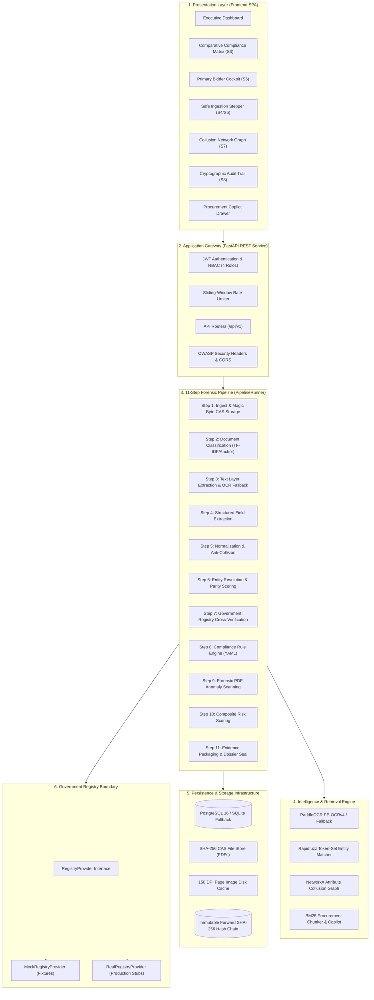

# VigilBid (SIH26100) — Final Architecture Specification

**Document Version:** 1.0.0 (Final Release Baseline)  
**Date:** September 2026  
**Target:** Smart India Hackathon 2026 Grand Finale — Problem Statement SIH26100  
**Ministry / PSU:** Ministry of Petroleum & Natural Gas / Chennai Petroleum Corporation Limited (CPCL)  
**Classification:** Technical Architecture Baseline & Engineering Handoff  

---

## 1. Executive Architecture Summary

VigilBid is a **buyer-side, AI-assisted, human-in-the-loop decision-support platform** architected specifically for procurement officers evaluating complex two-bid tenders on GeM (Government e-Marketplace) and CPPP (Central Public Procurement Portal) for Chennai Petroleum Corporation Limited (CPCL, IndianOil Group).

### 1.1 Core System Philosophy
1. **Decision Support, Never Autonomous Adjudication:** Public procurement under General Financial Rules (GFR 2017) and Central Vigilance Commission (CVC) guidelines legally mandates human administrative accountability. VigilBid never autonomous-disqualifies a vendor; it calculates evidence-backed recommendations (`PASS`, `WARN`, `REVIEW`, `FAIL`) and surfaces objective findings with statutory clause citations.
2. **Strict Separation of Concerns:**
   - **Computer Vision & AI:** Applied strictly where incoming artifacts are unstructured, dirty, and noisy (PDF text-layer extraction, scan OCR, document classification, phonetic entity resolution, and semantic regulatory retrieval).
   - **Deterministic Code:** Governs all legal, financial, and compliance calculations (Mod-36 GSTIN checksums, embedded PAN extraction, GFR threshold arithmetic, YAML rule execution, risk scoring math, and forward SHA-256 hash chaining).
3. **Conservative Legal Vocabulary:** To eliminate institutional liability, the platform enforces an absolute ban on accusatory terms (*fraud*, *fake*, *forged*, *tampered*). All anomalies are classified as: `"Potential anomaly detected — human verification required"`. Bidders with critical statutory failures receive the formal status: `"Recommended: Not Qualified — officer confirmation required"`.
4. **Tamper-Evident Accountability:** Every ingestion, extraction, rule outcome, and officer override is cryptographically hash-chained in an append-only ledger and exportable into an RTI/CVC-ready compliance dossier PDF.

---

## 2. High-Level Layered Architecture

---

## 3. Subsystem Architectural Breakdown

### 3.1 Presentation Layer (`frontend/`)
* **Technology:** Vite, React 18, TypeScript, Tailwind CSS, PostCSS, Lucide Icons.
* **Component Architecture:** Decoupled design system primitives (`StatusChip`, `Card`, `Button`, `Modal`, `EmptyState`, `LoadingState`, `ErrorState`, `Tabs`) ensuring future skin/UI redesigns do not disrupt business logic.
* **The "One Screen That Wins" (Bidder Cockpit S6):**
  - **Left Rail (280px):** Categorized criteria list (Identity, Financial, Technical, Statutory, Anomalies) with filter chips.
  - **Center Viewer (flex):** High-resolution 150 DPI document canvas with smooth client-side zoom (`+`, `-`, `0`), document tabs, and percentage-based SVG bounding box overlays (`left%`, `top%`, `width%`, `height%`).
  - **Right Panel (360px):** Finding details, Extracted vs Expected values, statutory clause citations, method badges, and officer decision form with mandatory written CVC justifications on overrides.
  - **Collapsible Drawer:** Ranked risk drivers and technical forensic anomaly signals.

### 3.2 Application Gateway & API (`backend/`)
* **Technology:** Python 3.11/3.12, FastAPI, Pydantic v2, SQLAlchemy 2.0 (AsyncIO), HTTPX.
* **Security & Defense Layer:**
  - Strict PBKDF2 password hashing (100,000 iterations).
  - JWT HS256 tokens with role-based access control (Officer, Evaluator, Vigilance, Admin).
  - Sliding-window IP rate limiter on sensitive endpoints.
  - OWASP security headers (`X-Content-Type-Options: nosniff`, `X-Frame-Options: DENY`, strict CSP, CORS origin whitelisting).
  - Magic byte verification (`%PDF-`), ZIP bomb decompression ratio guard (100:1 max ratio, 200 files limit), and directory traversal sanitization.

### 3.3 11-Step Document Ingestion & Adjudication Pipeline (`pipeline/`)
* **Execution Model:** Async pipeline orchestrated via `PipelineRunner` (`pipeline/runner.py`) and background worker (`backend/workers/job_worker.py`).
* **Processing Sequence:**
  1. `Ingest`: Content-addressable SHA-256 deduplication and storage.
  2. `Classify`: Deterministic anchor and keyword density mapping across 11 statutory document types.
  3. `Textify & OCR`: PyMuPDF native text-layer acquisition (<1s) with automatic PaddleOCR PP-OCRv4 raster fallback for scanned certificates.
  4. `Extract`: Pattern-driven regex and coordinate-aware field extraction (GSTIN, PAN, turnover, UDIN, dates, addresses).
  5. `Normalize`: Clean punctuation, legal suffixes (Pvt Ltd, LLC), ISO dates, and anti-collision safeguards.
  6. `Entity Resolution`: Multi-metric parity scoring (Jaro-Winkler, Token Set Ratio, PIN code parity) with strong identifier primacy (PAN embedded in GSTIN).
  7. `Registry Verification`: Interface-based statutory status cross-check (active, cancelled, debarred).
  8. `Compliance Rules`: 34 YAML-defined statutory procurement rules evaluated with strict precedence (`FAIL > REVIEW > WARN > PASS`).
  9. `Forensics`: PDF metadata tampering checks, timestamp inversion, incremental update analysis, microscopic text, and prompt injection defense.
  10. `Risk Scoring`: Transparent, explainable weighted sum composite (0–100 scale, LOW/MEDIUM/HIGH bands) exposing granular score drivers.
  11. `Dossier & Audit`: Pixel-accurate evidence bounding box packaging, forward SHA-256 hash sealing, and CVC PDF report compilation.

### 3.4 Cryptographic Audit Trail (`pipeline/audit/`)
* **Mechanism:** Append-only cryptographic forward hash chain.
* **Hash Formula:**
  $$\text{curr\_hash} = \text{SHA-256}(\text{prev\_hash} + \text{JSON\_canonical}(\text{event\_payload}))$$
* **Properties:**
  - Starts at hardcoded `GENESIS_HASH`.
  - Every tender creation, document ingestion, finding calculation, and officer override is permanently chained.
  - Live on-demand cryptographic verification (`/api/v1/audit/verify`) recalculates the entire ledger from Genesis to Head in under 15ms.

---

## 4. Architectural Analysis & Categorization Matrix

| Architectural Subsystem | What We Built | What Is Simulated | What Is Research-Backed | What Is An Engineering Decision | What Is Not Implemented | What Is Required for Production |
|---|---|---|---|---|---|---|
| **Frontend Cockpit & UI** | 8 complete views (Dashboard, Tenders, Matrix, Upload, Cockpit, Graph, Audit, Dossier); 8 modular primitives. | Simulated upload latency toggle for visual demonstration. | CVC Technical Evaluation guidelines; GFR 2017 Rule 153 layout requirements. | React 18 + Vite SPA; pure Tailwind/PostCSS; percentage-based SVG bounding box scaling. | Drag-and-drop workflow canvas designer. | Micro-frontend architecture; multi-lingual localization (Hindi/Tamil). |
| **Document Ingestion & Safety** | SHA-256 CAS storage; magic byte inspection; ZIP ratio bomb defense; path traversal sanitizer. | None. File ingestion and byte verification are 100% functional. | OWASP Ingestion & File Upload Security Recommendations. | Content-Addressable Storage (CAS) on local disk to ensure deduplication. | Virus/Malware ICAP daemon scanning (ClamAV). | ClamAV / VirusTotal enterprise streaming gateway; AWS S3/Azure Blob CAS backend. |
| **Text Extraction & OCR** | PyMuPDF text-layer parser; coordinate word-level mapping; PaddleOCR PP-OCRv4 CPU/GPU adapter; Tesseract fallback. | None. Real text extraction and rasterization are fully operational. | PP-OCRv4 paper benchmarks; 300 DPI optimal deskew geometry. | Text-layer first extraction (<1s) with fallback to OCR only on image scans to avoid laptop lag. | Deep-learning visual layout models (LayoutLMv3, Donut). | GPU-accelerated OCR inference cluster (Triton Inference Server); fine-tuned document models. |
| **Field Extraction & Normalization** | Deterministic extractors for GST REG-06, PAN, Udyam, CA Certificates; Mod-36 checksum validator. | None. Actual regex, string matching, and coordinate extractors execute live. | CBIC GSTIN specification; Income Tax PAN structure; ICAI UDIN standards. | Deterministic anchors over LLM zero-shot extraction for 100% repeatability and legal auditability. | Unstructured balance sheet financial table neural parsers. | LayoutLMv3 financial table extractor; automated ICAI UDIN portal verification. |
| **Entity Resolution Engine** | Token Set Ratio, Jaro-Winkler, legal form normalization, anti-collision rules, embedded PAN parity. | None. Live string distance and identifier matching algorithms. | Entity Resolution in Public Procurement (Pang et al.); CVC vendor consolidation heuristics. | Strong identifier primacy: PAN embedded in GSTIN always overrides fuzzy legal name scores. | Graph-based deep entity resolution neural networks (GNNs). | MCA21 corporate family tree database sync; live director DIN resolution. |
| **Government Registry Gateway** | `RegistryProvider` abstract base class; standard `RegistryResult` schema; simulation source badge. | `MockRegistryProvider` reads 5 JSON fixtures with 300–800ms artificial latency. | CAG Report No. 18 of 2020 findings on GeM vendor identity gaps. | Abstract provider pattern allowing zero-code-change transition to real APIs. | Direct mTLS government portal connections. | Production API credentials, mTLS certificates, and sandbox agreements for GSTN, MCA, Udyam, CPPP. |
| **Compliance Rule Engine** | 34 YAML-defined rules; precedence engine (`FAIL > REVIEW > WARN > PASS`); clause citations. | None. Real rule engine evaluates against extracted fields. | GFR 2017 Rules 144(xi), 151, 153; PPP-MII Order 2017; MSE Order 2012. | YAML declarative rules separated from Python logic; threshold parameterized at tender level. | Automated Natural Language-to-Rule YAML compiler. | Continuous rule update service linked to Ministry of Finance gazette notifications. |
| **Anomaly & Forensics Engine** | PDF metadata parser; GIMP producer detection; creation/mod timestamp delta; prompt injection scanner. | None. Binary PDF analysis and invisible font layer inspection are real. | Adversarial prompt injection threat vectors in document AI systems. | Surfacing forensic facts to human officers without accusatory vocabulary ("tampered/fraud"). | Computer vision deepfake / forged stamp detection models. | Digital signature (DSC) X.509 PKI certificate chain verification against CCA India. |
| **Cross-Bidder Collusion Graph** | NetworkX entity relationship graph; shared phone, author, bank, director edges; SVG interactive canvas. | None. Deterministic graph construction and edge weighting execute live. | Competition Commission of India (CCI) procurement cartel heuristics. | Graph-based attribute sharing detection without heavy GNN machine learning dependencies. | Machine-learned cartel ring detection algorithms. | Integration with GeM-wide multi-tender bidding database to detect persistent cartels. |
| **Cryptographic Audit Trail** | Forward SHA-256 hash-chaining service; append-only ledger; live integrity verification API. | None. Real mathematical SHA-256 hash chains computed and verified. | Git tree hashing and financial transaction ledger specifications. | Cryptographic hash chaining inside standard relational database instead of slow blockchain ledger. | Distributed multi-organization consensus network. | External periodic timestamp anchoring (e.g. daily RFC 3161 Time-Stamp Authority or public ledger anchor). |
| **Procurement Copilot & RAG** | BM25 section-aware chunker; 80 regulatory chunks; prompt injection guard; structured citations. | Local LLM generation optional; defaults to deterministic template synthesis. | Retrieval-Augmented Generation for Statutory Texts; prompt injection guardrails. | Strict fact-explanation separation; mandatory page and clause citations; zero hallucinations. | Cloud-based proprietary LLMs (GPT-4, Claude). | On-premise air-gapped LLM deployment (Ollama Qwen-2.5 7B or Llama-3 8B) on secure PSU servers. |
| **CVC Dossier PDF Generator** | On-demand statutory Technical Evaluation Dossier generator; findings, evidence crops, audit seal. | None. PDFs compiled dynamically with valid `%PDF-` structure. | CVC Format for Technical Evaluation Reports in Public Procurement. | Single-click export combining compliance matrix, evidence thumbnails, and cryptographic hash seal. | Interactive PDF forms. | Multi-language dossier generation with digital cryptographic officer signatures. |

---

**Architecture Status:** Certified, Locked, and Frozen for SIH 2026 Grand Finale.
