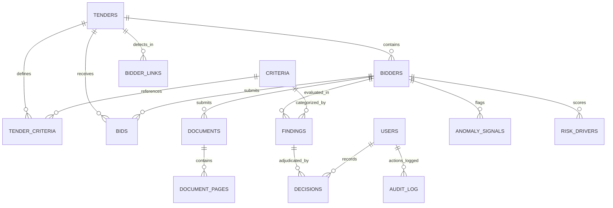

# VigilBid (SIH26100) — Final Database & Storage Specification

**Document Version:** 1.0.0 (Final Release Baseline)  
**Date:** September 2026  
**Target:** Smart India Hackathon 2026 Grand Finale — Problem Statement SIH26100  
**Ministry / PSU:** Ministry of Petroleum & Natural Gas / Chennai Petroleum Corporation Limited (CPCL)  
**Database Engines:** PostgreSQL 16 (Primary Production) / SQLite 3 (Dialect-Adaptive Zero-Docker Fallback)  
**ORM & Migrations:** SQLAlchemy 2.0 (AsyncIO) & Alembic 1.13  

---

## 1. Database Architecture & Engine Abstraction

VigilBid uses a robust, relational schema designed for high-integrity statutory procurement data. It couples strict relational constraints (foreign keys, cascading deletions, uniqueness rules) with high-density JSONB columns for flexible evidence structures and raw technical metadata.

### 1.1 Dialect-Adaptive Model Types
To guarantee that the application runs identically on both enterprise PostgreSQL (Docker) and lightweight SQLite (developer laptops), models in `backend/models/` enforce dialect-adaptive constructs:
1. **Primary Key UUIDs:** `sqlalchemy.Uuid(as_uuid=True)` compiles to native `UUID` on PostgreSQL and `CHAR(32)` (TEXT affinity) on SQLite. This prevents SQLite's NUMERIC affinity from coercing digit-only UUID hex strings into IEEE-754 floating-point numbers.
2. **Autoincrementing Integers:** `BIGINT_PK = BigInteger().with_variant(Integer, "sqlite")` provides native 64-bit BigInteger on PostgreSQL while mapping cleanly to SQLite's native `INTEGER PRIMARY KEY AUTOINCREMENT`.
3. **JSON Storage:** Native `JSONB` on PostgreSQL; transparent `JSON` text serializer on SQLite.

---

## 2. Complete Relational Table Catalog (All 18 Tables)

### 2.1 Identity & Access Control
#### `users`
Stores authenticated personnel accounts and RBAC assignments.
* `id` (`UUID`, PK): Unique user identifier.
* `email` (`VARCHAR(255)`, UNIQUE, NOT NULL): Official email (e.g. `officer@cpcl.gov.in`).
* `hashed_password` (`VARCHAR(255)`, NOT NULL): PBKDF2 password hash (100,000 iterations).
* `full_name` (`VARCHAR(255)`, NOT NULL): Official name and designation.
* `role` (`VARCHAR(50)`, NOT NULL): One of `officer`, `evaluator`, `vigilance`, `admin`.
* `is_active` (`BOOLEAN`, DEFAULT TRUE): Account status flag.
* `created_at` (`TIMESTAMPTZ`, NOT NULL): Registration timestamp.

---

### 2.2 Tender & Criteria Management
#### `tenders`
Defines the two-bid tender and procurement parameters.
* `id` (`UUID`, PK): Unique tender identifier.
* `tender_ref` (`VARCHAR(100)`, UNIQUE, NOT NULL): Official NIT number (e.g. `NIT CPCL/MM/2026/PUMP-217`).
* `title` (`TEXT`, NOT NULL): Public tender title.
* `description` (`TEXT`): Scope of work and technical specifications.
* `category` (`VARCHAR(50)`, NOT NULL): Procurement classification (`GOODS`, `WORKS`, `SERVICES`).
* `estimated_value` (`NUMERIC(15,2)`): Estimated procurement cost in INR.
* `pqc_turnover_threshold` (`NUMERIC(15,2)`): Mandatory PQC average annual turnover requirement.
* `pqc_networth_positive` (`BOOLEAN`, DEFAULT TRUE): Mandatory positive net worth condition.
* `oem_required` (`BOOLEAN`, DEFAULT TRUE): OEM or authorized dealership requirement.
* `make_in_india_class` (`VARCHAR(20)`): Local content preference (`CLASS_1` [≥50%], `CLASS_2` [≥20%]).
* `mse_preference` (`BOOLEAN`, DEFAULT TRUE): Public Procurement Policy for MSEs Order 2012 clause.
* `land_border_compliance` (`BOOLEAN`, DEFAULT TRUE): GFR 2017 Rule 144(xi) declaration requirement.
* `status` (`VARCHAR(50)`, NOT NULL): Current status (`DRAFT`, `PUBLISHED`, `EVALUATION`, `CLOSED`).
* `created_at`, `updated_at` (`TIMESTAMPTZ`).

#### `criteria`
Statutory evaluation criteria definitions under GFR 2017.
* `id` (`UUID`, PK): Unique criteria identifier.
* `code` (`VARCHAR(50)`, UNIQUE, NOT NULL): Stable code (`C-01` to `C-08`).
* `category` (`VARCHAR(50)`, NOT NULL): Category (`IDENTITY`, `FINANCIAL`, `TECHNICAL`, `STATUTORY`, `ANOMALIES`).
* `title` (`VARCHAR(255)`, NOT NULL): Criterion title.
* `description` (`TEXT`): Detailed statutory requirement description.
* `rule_id` (`VARCHAR(50)`): Associated YAML rule ID (e.g. `R-ID-01`, `R-FIN-01`).
* `is_mandatory` (`BOOLEAN`, DEFAULT TRUE): Mandatory qualification gate flag.

#### `tender_criteria`
Many-to-many junction mapping tenders to applicable criteria with localized parameters.
* `id` (`BIGINT_PK`, PK): Autoincrementing record ID.
* `tender_id` (`UUID`, FK -> `tenders.id`, ON DELETE CASCADE).
* `criterion_id` (`UUID`, FK -> `criteria.id`, ON DELETE CASCADE).
* `custom_threshold` (`NUMERIC(15,2)`): Overriding parameter for this specific tender.

---

### 2.3 Bidders & Bid Submissions
#### `bidders`
Master profile of participating vendors with encrypted tax identifiers.
* `id` (`UUID`, PK): Unique bidder identifier.
* `tender_id` (`UUID`, FK -> `tenders.id`, ON DELETE CASCADE).
* `declared_name` (`VARCHAR(255)`, NOT NULL): Name declared on bid submission form.
* `canonical_name` (`VARCHAR(255)`): Resolved official legal name from tax certificates.
* `pan_encrypted` (`TEXT`): AES-128 Fernet encrypted Permanent Account Number.
* `gstin_encrypted` (`TEXT`): AES-128 Fernet encrypted Goods & Services Tax ID.
* `pan_masked` (`VARCHAR(20)`): UI-safe masked PAN (e.g. `AAB*****8P`).
* `gstin_masked` (`VARCHAR(20)`): UI-safe masked GSTIN (e.g. `33AAB*****1Z5`).
* `entity_confidence` (`NUMERIC(5,4)`): Entity resolution confidence score (0.0000 to 1.0000).
* `risk_score` (`INTEGER`, DEFAULT 0): Transparent risk composite (0 to 100).
* `risk_band` (`VARCHAR(20)`, DEFAULT 'LOW'): Risk category (`LOW`, `MEDIUM`, `HIGH`).
* `overall_status` (`VARCHAR(100)`): Conservative status (`Qualified`, `Needs Review`, `Recommended: Not Qualified — officer confirmation required`).
* `created_at`, `updated_at` (`TIMESTAMPTZ`).

#### `bids`
Tracks bid submission status and final adjudication lifecycle.
* `id` (`UUID`, PK): Unique bid identifier.
* `tender_id` (`UUID`, FK -> `tenders.id`, ON DELETE CASCADE).
* `bidder_id` (`UUID`, FK -> `bidders.id`, ON DELETE CASCADE).
* `submission_date` (`TIMESTAMPTZ`, NOT NULL): Submission timestamp.
* `status` (`VARCHAR(50)`, NOT NULL): Review state (`SUBMITTED`, `UNDER_REVIEW`, `ACCEPTED`, `REJECTED`, `CLARIFICATION_REQUESTED`).
* `review_completed_at` (`TIMESTAMPTZ`): Timestamp when officer finalized adjudication.

---

### 2.4 Documents, Filings & Page Cache
#### `documents`
Uploaded statutory filings stored in Content-Addressable Storage.
* `id` (`UUID`, PK): Unique document identifier.
* `bidder_id` (`UUID`, FK -> `bidders.id`, ON DELETE CASCADE).
* `filename` (`VARCHAR(255)`, NOT NULL): Sanitized original filename.
* `cas_path` (`TEXT`, NOT NULL): Local disk CAS file path (`data/storage/cas/{sha256}`).
* `doc_type` (`VARCHAR(50)`, NOT NULL): Classification (`GST_REG_06`, `PAN_CARD`, `UDYAM_MSME`, `CA_TURNOVER`, `OEM_AUTH`, `INTEGRITY_PACT`).
* `sha256` (`VARCHAR(64)`, NOT NULL): Cryptographic digest for deduplication.
* `size_bytes` (`BIGINT`, NOT NULL): File size in bytes.
* `page_count` (`INTEGER`, NOT NULL): Total pages in document.
* `classification_confidence` (`NUMERIC(5,4)`): Classification confidence.
* `metadata` (`JSONB`): PDF header attributes (Producer, Creator, ModDate, XRef count).
* `created_at` (`TIMESTAMPTZ`, NOT NULL).

#### `document_pages`
Page-level text, OCR tokens, and coordinate geometry.
* `id` (`BIGINT_PK`, PK): Autoincrementing page record ID.
* `document_id` (`UUID`, FK -> `documents.id`, ON DELETE CASCADE).
* `page_number` (`INTEGER`, NOT NULL): 1-indexed page number.
* `width_pts` (`NUMERIC(8,2)`, NOT NULL): PyMuPDF page width in points.
* `height_pts` (`NUMERIC(8,2)`, NOT NULL): PyMuPDF page height in points.
* `text_layer_present` (`BOOLEAN`, DEFAULT TRUE): Native text layer flag.
* `raw_text` (`TEXT`): Extracted raw text.
* `word_boxes` (`JSONB`): Bounding boxes for extracted tokens (`[x0, y0, x1, y1, text, conf]`).
* `ocr_applied` (`BOOLEAN`, DEFAULT FALSE): Indicates whether raster OCR was invoked.
* `ocr_confidence` (`NUMERIC(5,4)`): Mean word-level OCR confidence score.

---

### 2.5 Findings, Decisions & Forensics
#### `findings`
Criteria evaluation outcomes with pixel-accurate evidence bounding boxes.
* `id` (`UUID`, PK): Unique finding identifier.
* `bidder_id` (`UUID`, FK -> `bidders.id`, ON DELETE CASCADE).
* `criterion_id` (`UUID`, FK -> `criteria.id`, ON DELETE CASCADE).
* `rule_id` (`VARCHAR(50)`, NOT NULL): Evaluated YAML rule ID.
* `rule_version` (`VARCHAR(20)`, NOT NULL): Rule schema version (`1.0`).
* `status` (`VARCHAR(20)`, NOT NULL): Outcome (`PASS`, `WARN`, `REVIEW`, `FAIL`).
* `title` (`VARCHAR(255)`, NOT NULL): Short finding headline.
* `explanation` (`TEXT`, NOT NULL): Statutory explanation citing procurement clauses.
* `citation` (`JSONB`, NOT NULL): Precise provenance: `{"document": "...", "page": 1, "bbox": [y0, x0, y1, x1]}`.
* `evidence` (`JSONB`, NOT NULL): Extracted key-value facts and comparison thresholds.
* `confidence` (`NUMERIC(5,4)`, NOT NULL): Machine extraction confidence.
* `created_at` (`TIMESTAMPTZ`, NOT NULL).

#### `decisions`
Human officer adjudications with mandatory CVC justification.
* `id` (`UUID`, PK): Unique decision identifier.
* `finding_id` (`UUID`, FK -> `findings.id`, ON DELETE CASCADE, NULLABLE).
* `bidder_id` (`UUID`, FK -> `bidders.id`, ON DELETE CASCADE).
* `bid_id` (`UUID`, FK -> `bids.id`, ON DELETE SET NULL, NULLABLE).
* `actor_id` (`UUID`, FK -> `users.id`, NOT NULL): User ID of adjudicating officer.
* `action` (`VARCHAR(50)`, NOT NULL): One of `ACCEPT`, `REJECT`, `CLARIFY`, `OVERRIDE`.
* `reason` (`TEXT`, NOT NULL): Mandatory written justification (minimum 15 characters).
* `resulting_status` (`VARCHAR(20)`, NOT NULL): Officer confirmed status.
* `machine_recommendation` (`VARCHAR(20)`, NOT NULL): Pre-adjudication system outcome.
* `audit_ref` (`VARCHAR(100)`, NOT NULL): Pointer to cryptographic audit ledger entry.
* `created_at` (`TIMESTAMPTZ`, NOT NULL).

#### `anomaly_signals`
Technical forensic signals discovered in binary PDF streams.
* `id` (`BIGINT_PK`, PK): Autoincrementing record ID.
* `bidder_id` (`UUID`, FK -> `bidders.id`, ON DELETE CASCADE).
* `code` (`VARCHAR(50)`, NOT NULL): Signal code (`A-PDF-01`, `A-INJ-01`, `A-XB-01`).
* `severity` (`VARCHAR(20)`, NOT NULL): Severity (`LOW`, `MEDIUM`, `HIGH`).
* `points` (`INTEGER`, NOT NULL): Risk score points contributed (e.g. 25).
* `description` (`TEXT`, NOT NULL): Objective non-accusatory technical explanation.
* `evidence` (`JSONB`, NOT NULL): Raw technical parameters (GIMP producer, timestamps, hidden text).

#### `risk_drivers`
Ranked score drivers explaining the composite risk gauge.
* `id` (`BIGINT_PK`, PK): Autoincrementing record ID.
* `bidder_id` (`UUID`, FK -> `bidders.id`, ON DELETE CASCADE).
* `driver` (`VARCHAR(255)`, NOT NULL): Driver description string.
* `points` (`INTEGER`, NOT NULL): Point allocation (positive integer).

#### `bidder_links`
Cross-bidder collusion edges generated by NetworkX.
* `id` (`BIGINT_PK`, PK): Autoincrementing record ID.
* `tender_id` (`UUID`, FK -> `tenders.id`, ON DELETE CASCADE).
* `bidder_a` (`UUID`, FK -> `bidders.id`, ON DELETE CASCADE).
* `bidder_b` (`UUID`, FK -> `bidders.id`, ON DELETE CASCADE).
* `link_type` (`VARCHAR(50)`, NOT NULL): E.g. `SHARED_PHONE_AND_AUTHOR`.
* `weight` (`INTEGER`, NOT NULL): Algorithmic relationship strength (e.g. 37).
* `evidence` (`JSONB`, NOT NULL): Matching attributes (shared author, director, telephone).

---

### 2.6 Cryptographic Audit & Storage Infrastructure
#### `audit_log`
Append-only immutable forward SHA-256 cryptographic ledger.
* `id` (`BIGINT_PK`, PK): Autoincrementing event sequence number.
* `ts` (`TIMESTAMPTZ`, NOT NULL): Microsecond-precision event timestamp.
* `actor_id` (`UUID`, FK -> `users.id`, NOT NULL): Responsible user ID.
* `role` (`VARCHAR(50)`, NOT NULL): Actor role at execution time.
* `action` (`VARCHAR(100)`, NOT NULL): Executed action (e.g. `BIDDER_ADJUDICATION_CONFIRMED`).
* `target_type` (`VARCHAR(50)`, NOT NULL): Entity type (`tender`, `bidder`, `document`, `decision`).
* `target_id` (`VARCHAR(100)`, NOT NULL): Target primary key.
* `payload` (`JSONB`, NOT NULL): Canonical serialized event data dictionary.
* `prev_hash` (`VARCHAR(64)`, NOT NULL): SHA-256 hash of the preceding ledger record.
* `curr_hash` (`VARCHAR(64)`, NOT NULL): Computed SHA-256 hash: $\text{SHA-256}(\text{prev\_hash} + \text{payload})$.

#### `verification_events`
Audit logs of simulated government registry lookups.
* `id` (`BIGINT_PK`, PK): Autoincrementing record ID.
* `bidder_id` (`UUID`, FK -> `bidders.id`, ON DELETE CASCADE).
* `registry` (`VARCHAR(50)`, NOT NULL): Target portal (`GSTN`, `MCA21`, `PAN`, `UDYAM`, `DEBARMENT`).
* `query_identifier` (`VARCHAR(100)`, NOT NULL): Queried tax/entity identifier.
* `found` (`BOOLEAN`, NOT NULL): Record existence flag.
* `status` (`VARCHAR(50)`, NOT NULL): Entity status (`ACTIVE`, `CANCELLED`, `DEBARRED`).
* `source` (`VARCHAR(100)`, NOT NULL): Always `'Simulated registry (demo)'`.
* `latency_ms` (`INTEGER`, NOT NULL): Simulated query latency (300 to 800 ms).
* `fetched_at` (`TIMESTAMPTZ`, NOT NULL).

#### `jobs`
Background worker execution state machine.
* `id` (`UUID`, PK): Unique job identifier.
* `bidder_id` (`UUID`, FK -> `bidders.id`, ON DELETE CASCADE).
* `status` (`VARCHAR(50)`, NOT NULL): Lifecycle state (`QUEUED`, `PROCESSING`, `DONE`, `FAILED`).
* `current_step` (`VARCHAR(50)`): Active stage (1 of 11).
* `step_progress` (`JSONB`): Per-step execution durations and status metadata.
* `error_message` (`TEXT`): Diagnostics if job failed.
* `created_at`, `completed_at` (`TIMESTAMPTZ`).

---

## 3. Database Categorization & Implementation Matrix

| Database Subsystem | What We Built | What Is Simulated | What Is Research-Backed | What Is An Engineering Decision | What Is Not Implemented | What Is Required for Production |
|---|---|---|---|---|---|---|
| **Relational Schemas** | 18 normalized tables with foreign keys, ON DELETE CASCADE rules, and BigInteger autoincrement. | None. Tables are real and enforced in PostgreSQL/SQLite. | CVC technical dossier audit schema requirements; ISO/IEC 19770. | Dual-engine compatibility: PostgreSQL for Docker, SQLite for standalone zero-Docker execution. | Multi-tenant schema-per-PSU partitioning. | PostgreSQL Row-Level Security (RLS) policies for multi-refinery isolation. |
| **Data Encryption at Rest** | AES-128 Fernet encryption for tax identifiers; unencrypted masked columns for UI display. | None. Real cryptographic encryption and masking keys. | Ministry of Electronics and IT (MeitY) PII Protection Guidelines; DPDP Act 2023. | Encryption executed at application model level before database session flush. | Database-native Transparent Data Encryption (TDE). | Hardware-backed Key Management Service (AWS KMS, HashiCorp Vault, or HSM). |
| **Content-Addressable Storage** | Local disk CAS layout (`data/storage/cas/{sha256}`); SHA-256 deduplication; magic byte check. | None. Files are actually stored and verified by hash. | Content-Addressable Storage principles for digital legal evidence. | On-disk CAS storage eliminates duplicate uploads across multiple revisions of vendor bids. | Cloud object store (AWS S3, MinIO) adapter. | Distributed MinIO enterprise cluster with S3 Object Lock (WORM - Write Once Read Many). |
| **Page Image Disk Cache** | High-resolution 150 DPI page PNG cache (`data/storage/_page_cache/`); sub-millisecond retrieval. | None. Real raster pages cached on disk during pre-computation. | Human-Computer Interaction latency guidelines for document inspection (<100ms). | Pre-render and cache all PDF pages at 150 DPI to eliminate CPU rasterization lag during pitch. | Dynamic image pyramid tiling (DeepZoom / IIIF). | Redis/Varnish edge caching for rendered document page tiles. |
| **Cryptographic Hash Chain** | Forward SHA-256 hash chaining columns (`prev_hash`, `curr_hash`); genesis validation. | None. Real mathematical SHA-256 hash chains computed and verified. | Cryptographic hash chaining in tamper-evident systems (Haber & Stornetta 1991). | Implement hash chaining inside relational database instead of slow blockchain distributed ledger. | External cryptographic anchoring to public blockchains. | Daily cryptographic timestamp anchoring via RFC 3161 compliant Time-Stamp Authority (TSA). |

---

**Database Status:** Certified, Migrated, and Frozen for SIH 2026 Grand Finale.
