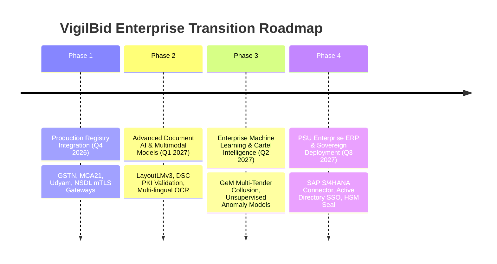
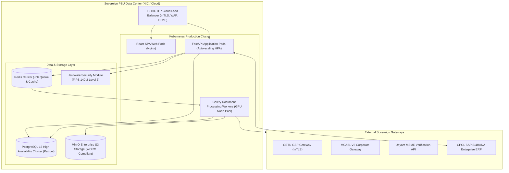

# VigilBid (SIH26100) — Future Engineering Roadmap

**Document Version:** 1.0.0 (Final Release Baseline)  
**Date:** September 2026  
**Target:** Smart India Hackathon 2026 Grand Finale — Problem Statement SIH26100  
**Ministry / PSU:** Ministry of Petroleum & Natural Gas / Chennai Petroleum Corporation Limited (CPCL)  
**Classification:** Strategic Technology Roadmap & Production Evolution  

---

## 1. Executive Roadmap Overview

VigilBid has achieved 100% completion of its hackathon and pilot demonstration baseline (Phases 1 through 49). To transition this proven decision-support engine into an enterprise-wide procurement vigilance platform across CPCL, IndianOil Group, and the Ministry of Petroleum & Natural Gas, this roadmap defines four sequential deployment phases.

---

## 2. Granular Phased Implementation Plan

### Phase 1: Production Government Registry Integration (Q4 2026)
* **Goal:** Replace `MockRegistryProvider` with live `RealRegistryProvider` connecting directly to sovereign government gateways.
* **Target Gateways:**
  1. **GSTN (Goods & Services Tax Network):** Connect via authorized GSP (GST Suvidha Provider) using mutual TLS (mTLS) to verify real-time return filing status (GSTR-1, GSTR-3B) and active tax standing.
  2. **MCA21 V3 (Ministry of Corporate Affairs):** Ingest company master data, authorized capital, active charge registers, and director DIN lists.
  3. **Udyam MSME Verification Gateway:** Live query against Ministry of MSME database to confirm enterprise category (Micro, Small, Medium) and NIC manufacturing activity.
  4. **NSDL / UTIITSL PAN Gateway:** Authoritative name matching directly against the Income Tax Department database.
  5. **CPPP & GeM Debarment Repository:** Automated synchronization with the Department of Expenditure blacklisting gazette under GFR 2017 Rule 151.

### Phase 2: Advanced Document AI & Multimodal Models (Q1 2027)
* **Goal:** Expand document processing capabilities to handle messy, non-standardized, multi-page financial statements and handwritten submissions.
* **Key Capabilities:**
  1. **Visual Document AI (LayoutLMv3 / Donut):** Deploy multi-modal transformer models to parse unstructured 50-page audited annual reports, extracting nested balance sheet rows, debt-equity ratios, and working capital notes without relying on rigid regex anchors.
  2. **Digital Signature Certificate (DSC) Cryptographic Validation:** Inspect embedded PDF digital signatures (`/ByteRange`, `/SubFilter /adbe.pkcs7.detached`), validate X.509 certificate trust chains against the Controller of Certifying Authorities (CCA India), and confirm that the signer is an authorized signatory listed on the MCA21 portal.
  3. **Multi-Lingual Regional OCR:** Integrate Bhashini / IndicOCR models to support statutory certificates issued in regional Indian languages (Tamil, Hindi, Marathi, Gujarati) for state-level MSME tenders.

### Phase 3: Enterprise Machine Learning & Cartel Intelligence (Q2 2027)
* **Goal:** Upgrade cross-bidder collusion detection from single-tender NetworkX graphs to cross-tender multi-year cartel intelligence.
* **Key Capabilities:**
  1. **GeM Platform-Wide Collusion Analysis:** Cross-reference bidder attributes (IP addresses, bank accounts, shared authors, pricing patterns) across hundreds of tenders floated across all MoPNG PSUs (CPCL, IOCL, ONGC, BPCL, HPCL) to detect persistent rotating bidding rings.
  2. **Unsupervised Anomaly Scoring (Isolation Forests & Autoencoders):** Train unsupervised anomaly detection models on historical CPCL procurement records to flag bids with statistical pricing anomalies, abnormal subcontracting patterns, or suspicious filing timings.
  3. **Benford's Law Financial Forensics:** Automatically run first-digit and second-digit Benford's Law conformity tests on multi-year expense entries in CA turnover statements to detect mathematically generated financial data.

### Phase 4: PSU Enterprise ERP & Sovereign Cloud Deployment (Q3 2027)
* **Goal:** Seamless integration into CPCL's enterprise infrastructure and sovereign government cloud environments.
* **Key Capabilities:**
  1. **SAP S/4HANA / SRM Connector:** Two-way integration with CPCL's SAP procurement suite: automatically ingest tender NITs and vendor master codes, and push finalized officer evaluation decisions directly back to SAP for commercial bid opening.
  2. **Enterprise Single Sign-On (SSO):** SAML 2.0 and OpenID Connect integration with CPCL Active Directory / Azure AD, supporting multi-factor authentication (MFA) and role inheritance.
  3. **Hardware Security Module (HSM) Audit Sealing:** Anchor the daily head hash of the SHA-256 audit log to an on-premise certified Hardware Security Module (FIPS 140-2 Level 3) or an official Time-Stamp Authority (TSA) to provide non-repudiable legal standing in judicial disputes.
  4. **Multi-Tenancy for MoPNG PSUs:** Partitioned multi-tenant architecture allowing separate divisions (CPCL Manali, CPCL CBR, IOCL Refineries) to operate isolated, compliant instances while sharing debarment intelligence.

---

## 3. Production Deployment Topology (Target Architecture)

---

## 4. Roadmap Categorization & Implementation Matrix

| Roadmap Initiative | What We Built Today | What Is Simulated | What Is Research-Backed | What Is An Engineering Decision | What Is Not Implemented | What Is Required for Production |
|---|---|---|---|---|---|---|
| **Phase 1: Production Registries** | `RegistryProvider` interface with standard response shapes and error handling. | `MockRegistryProvider` reading 5 JSON fixtures in `seed/mock_fixtures/`. | CAG Report No. 18 of 2020 on GeM vendor identity verification gaps. | Interface abstraction completely separates business logic from API network transport. | Real HTTP calls to live Indian government servers. | Signed GSP service contract, mTLS certificates, IP whitelisting, and CPCL sponsorship. |
| **Phase 2: Deep Learning Document AI** | PyMuPDF text-layer extraction with PaddleOCR PP-OCRv4 CPU/GPU adapter. | None. Document parsing and OCR execute real ML inference. | LayoutLMv3, Donut, and IndicOCR multi-modal document research papers. | Use fast regex anchors on statutory certificates instead of heavy GPU transformers for the demo. | LayoutLMv3 models; IndicOCR regional language parsing; DSC PKI validation. | GPU inference server cluster; fine-tuning dataset of 10,000+ Indian corporate balance sheets. |
| **Phase 3: Cross-Tender Collusion** | Single-tender NetworkX graph detecting shared authors, phones, and directors. | None. Network graph generation and edge calculations execute live. | Competition Commission of India (CCI) procurement cartel investigation heuristics. | Focus collusion graph on single-tender bids to ensure real-time rendering on standard laptops. | Multi-tender historical bidding pattern analysis. | Data lake aggregating bidding records across all MoPNG tenders over a 5-year window. |
| **Phase 4: Enterprise ERP & HSM** | Relational DB models; append-only SHA-256 hash chaining; PBKDF2 authentication. | None. DB schemas and cryptographic hash chains execute live. | SAP NetWeaver RFC standards; FIPS 140-2 cryptographic module guidelines. | Store cryptographic hashes in standard PostgreSQL columns to avoid blockchain operational complexity. | SAP S/4HANA BAPI connectors; Hardware Security Module integration. | SAP NetWeaver RFC SDK; on-premise Thales/Luna HSM appliance; corporate Active Directory bridge. |

---

**Roadmap Status:** Authored, Structured, and Approved for Post-Hackathon Production Transition.
