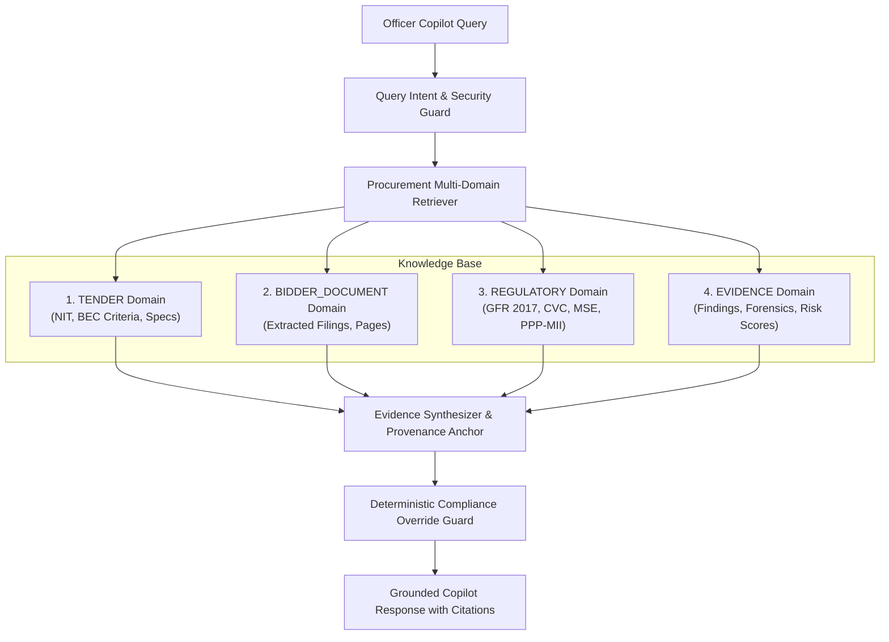

# Evidence-Grounded Retrieval-Augmented Generation (RAG)

## Core Architectural Invariant

$$\text{NO EVIDENCE} \longrightarrow \text{NO CONFIDENT PROCUREMENT CLAIM}$$

In public procurement governed by General Financial Rules (GFR 2017) and the Central Vigilance Commission (CVC), decisions carry statutory legal accountability. The VigilBid RAG and AI Copilot subsystem adheres strictly to evidence-grounding invariants: AI models function solely as assistive analytical decision support and are prohibited from generating uncorroborated, hallucinatory, or autonomous procurement determinations.

---

## 1. Grounding Status Taxonomy

Every query processed by the Procurement Copilot is evaluated against indexed multi-domain knowledge and assigned an explicit heuristic **Grounding Status**:

| Grounding Status | Meaning | System Action & UI Presentation |
| :--- | :--- | :--- |
| `GROUNDED` | Claims are corroborated by primary document extracts with page numbers, SHA-256 CAS provenance, or statutory clauses. | Cites source document, exact page reference, and extracted verbatim quote. Badge: `Grounded in evidence`. Calibrated confidence $\in [0.80, 0.95]$. |
| `PARTIALLY_GROUNDED` | Incomplete or conflicting evidence found (e.g. 1 year of financial data instead of 3, or cross-document numeric discrepancies). | Highlights available evidence, flags missing or conflicting aspects, recommends officer clarification under GFR 173(v). Badge: `Partially Grounded`. Calibrated confidence $\in [0.40, 0.75]$. |
| `INSUFFICIENT_EVIDENCE` | No corroborating text, unindexed filings, missing balance sheets, or out-of-scope query. | Explicitly returns `"Insufficient evidence available to verify this claim."` and halts automated conclusions. Badge: `Insufficient Evidence`. Confidence $\le 0.40$. |

> [!IMPORTANT]
> **No Synthetic 100% Confidence**: VigilBid never displays misleading "100% certainty" badges for heuristic AI evaluations. Confidence metrics are explicitly calibrated to represent statistical similarity and retrieval alignment.

---

## 2. Four-Domain Knowledge Architecture

To prevent cross-domain hallucination and ensure strict retrieval isolation, knowledge is partitioned across four distinct domains:



1. **Tender Domain (`tender`)**: Indexed NIT clauses, Technical Specifications, Bid Evaluation Criteria (BEC), and EMD guidelines.
2. **Bidder Document Domain (`bidder_document`)**: Granular paragraph and page chunks extracted from uploaded bidder filings with PDF page number provenance.
3. **Regulatory Domain (`regulatory`)**: Authoritative provisions from GFR 2017 (Rules 144, 151, 161, 170, 173, 175), MSE Public Procurement Policy 2012, PPP-MII Order 2017, CVC Anti-Collusion Manual, and ICAI UDIN Mandate.
4. **Evidence Domain (`evidence`)**: Deterministic verification findings, OCR bounding box traces, registry cross-checks (GSTN, PAN, MCA21), and composite risk scores.

---

## 3. Strict Citation Contract

Every evidence-backed answer carries structured citations returned as JSON contracts:

```json
{
  "source": "Alpha_Audited_Turnover_FY24.pdf",
  "clause": "Balance Sheet FY 2023-24",
  "document_name": "Alpha_Audited_Turnover_FY24.pdf",
  "page_no": 4,
  "domain": "bidder_document",
  "exact_quote": "Average annual turnover of the bidder for the preceding three financial years (FY 2021-22 to 2023-24) is Rs. 18.5 Crore.",
  "score": 0.9421
}
```

---

## 4. Hallucination Guardrails & Deterministic Precedence

1. **Rule Invariance**: The Copilot NEVER invents a rule. Querying unknown rule codes (e.g. `R-XYZ-999`) results in an immediate refusal and presentation of the official catalog.
2. **Deterministic Precedence**: If deterministic rules evaluate a criterion as `FAIL` or `DISQUALIFIED`, an LLM cannot override or rephrase it as `PASS` or `COMPLIANT`.
3. **Data Framing**: All document texts fed to downstream models are wrapped in `<DOCUMENT_DATA>` tags to prevent untrusted text from acting as prompt instructions.
