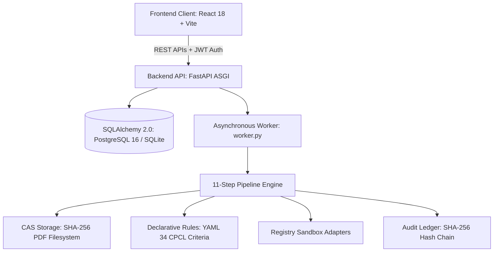

# Current System Map — VigilBid (SIH26100)

> **Document Purpose:** Complete architectural topology and component inventory of the active VigilBid system.  
> **Source of Truth:** Codebase state verified via automated testing baseline.

---

## 1. Top-Level Architectural Overview

VigilBid is structured as a **Modular Monolith** with clear bounded contexts:

---

## 2. Component Inventory

### 2.1 Frontend Client (`frontend/`)
- **Technology:** React 18, Vite 5, TypeScript, Vanilla CSS design tokens.
- **Routing:** Hash-based SPA routing with unauthenticated public demo access at `/#/demo`.
- **Key Views:**
  - `Dashboard.tsx`: Executive procurement overview, compliance distribution, risk breakdown, and audit status.
  - `TenderView.tsx`: Tender configuration, GFR 2017 criteria threshold mapping.
  - `ComplianceMatrix.tsx`: High-density multi-bidder criteria matrix with sticky identity columns and status chips.
  - `BidderCockpit.tsx`: Detailed bidder evaluation view with tabs for findings, fields, documents, and adjudication.
  - `EvidenceViewer.tsx`: Split-screen PDF canvas rendering yellow coordinate bounding boxes over source text.
  - `AuditLedger.tsx`: Chronological event stream with live SHA-256 hash-chain verification and hash copy.
  - `CollusionGraph.tsx`: Cross-bidder relationship graph highlighting shared phone numbers and identical file hashes.
  - `DemoTour.tsx`: Standalone, zero-login 5-bidder tour for competition judges.

### 2.2 Backend REST API (`backend/`)
- **Framework:** FastAPI ASGI running on Python 3.11 with Uvicorn.
- **Security & RBAC:** OAuth2 with HMAC-SHA256 JWT tokens supporting 4 roles: `Officer`, `Approver`, `Auditor`, `Admin`.
- **Routers (`backend/routers/`):**
  - `auth.py`: Token issue, user profile, password verification.
  - `tenders.py`: Tender CRUD, criteria listing, tender document ingestion.
  - `bidders.py`: Bidder registration, document package submission, status queries.
  - `documents.py`: File ingestion with zip-bomb protection, CAS download with path-traversal defense.
  - `compliance.py`: Multi-bidder compliance matrix, criteria evaluation queries.
  - `risk.py`: Composite risk score retrieval, anomaly factor inspection, collusion graph.
  - `officer.py`: Adjudication recording (`ACCEPT`, `OVERRIDE`, `CLARIFY`) with mandatory CVC justification.
  - `audit.py`: Audit trail streaming, live runtime cryptographic hash-chain verification.
  - `reports.py`: Dynamic CVC compliance PDF dossier generation.
  - `copilot.py`: RAG-backed regulatory query assistant with grounded citations.
  - `registry.py`: Government registry verification routes for GSTN, PAN, Udyam, and Debarment.

### 2.3 11-Step Verification Pipeline (`pipeline/`)
The processing pipeline executes 11 discrete, idempotent modules coordinated by `pipeline/runner.py`:
1. `01_ingest.py`: Decompresses ZIP archives, checks magic bytes (`%PDF-`), calculates SHA-256 digests, stores in CAS.
2. `02_classify.py`: Categorizes 13 document types via TF-IDF vectorization and layout tokens.
3. `03_ocr.py`: PyMuPDF digital text extraction with automatic local Tesseract 5.0 OCR fallback for scans.
4. `04_extract.py`: Regex and token anchor extraction for tax IDs, fiscal figures, UDINs, dates, and bboxes.
5. `05_normalize.py`: Standardizes Indian fiscal notations (Lakhs/Crores), date formats, and entity suffixes.
6. `06_entity_resolution.py`: Validates sub-string PAN-in-GSTIN containment and Jaro-Winkler string similarity ($\ge 0.85$).
7. `07_registry.py`: Cross-checks credentials against simulated sandbox adapters.
8. `08_rules.py`: Deterministically executes 34 CPCL Goods criteria under GFR 2017.
9. `09_anomalies.py`: Flags PDF timestamp anomalies, GIMP signatures, and prompt injection attempts.
10. `10_risk.py`: Computes 0–100 composite risk score across Identity, Financial, Compliance, and Anomaly factors.
11. `11_report.py`: Programmatically generates formal, signed CVC compliance PDF dossiers via ReportLab.

### 2.4 Database & Storage Layer (`backend/models/`, `data/`)
- **ORM:** SQLAlchemy 2.0 with asynchronous (`asyncpg`/`aiosqlite`) and synchronous sessions.
- **Relational Models (18 tables):** `User`, `Tender`, `Criteria`, `Bidder`, `Document`, `DocumentPage`, `ExtractedField`, `ComplianceFinding`, `EvidenceItem`, `RiskScore`, `RiskDriver`, `Anomaly`, `CollusionLink`, `OfficerDecision`, `AuditEvent`, `RegistryCache`, `RegulatoryRule`, `TenderRequirement`.
- **Filesystem Storage:** Local Content-Addressable Storage (CAS) rooted at `data/storage/{bidder_id}/{sha256}.pdf`.

### 2.5 Compliance Rules Engine (`rules/`)
- Declarative YAML rules defined in `rules/cpcl_goods_v1.yaml`.
- 34 Goods procurement criteria mapped directly to statutory clauses (GFR Rule 144, Rule 153, PPP-MII Order 2017).
- Traffic-light outputs: `PASS`, `WARN`, `REVIEW`, `FAIL`, `PENDING`.

### 2.6 Regulatory RAG Copilot (`pipeline/rag/`)
- Procurement knowledge retriever indexing GFR 2017, CVC Manual, and GeM guidelines.
- Grounded query-response generation with explicit clause citations.
- Tested and backward-compatible with legacy copilot interfaces.

### 2.7 Government Registry Sandbox Adapters (`pipeline/registry/`)
- High-fidelity simulated adapters with realistic latency:
  - **GSTN:** Active, Cancelled, and Non-existent GSTIN responses.
  - **PAN:** CBDT status verification and structure checks.
  - **Udyam:** MSME enterprise category validation (Micro, Small, Medium).
  - **MCA-21:** Corporate Identification Number (CIN) verification.
  - **CVC Debarment:** Banned and suspended supplier screening.

### 2.8 Cryptographic Audit System (`backend/services/audit_service.py`)
- Forward SHA-256 hash chaining: $H_n = \text{SHA-256}(H_{n-1} \,\|\, \text{Timestamp} \,\|\, \text{User} \,\|\, \text{Action} \,\|\, \text{Payload})$.
- Genesis block initialized on tender setup.
- Live verification endpoint (`GET /api/v1/audit/verify`) traverses the entire chain from genesis to head.

### 2.9 Automated Test Baseline (`tests/`, `scripts/`)
- **Backend Tests:** 353 unit and integration tests passing in pytest (`tests/`).
- **Frontend Tests:** 70 unit and UI integrity tests passing (`frontend/src/__tests__/`, `frontend/scripts/test-ui-components.js`).
- **Release Audit:** 20/20 subsystems verified in `scripts/release_audit.py`.

### 2.10 Deployment & Orchestration
- **Docker Compose:** 4 isolated services (`db`, `backend`, `frontend`, `worker`).
- **Zero-Docker:** Standalone local deployment via Uvicorn, background worker, and Vite dev server.
