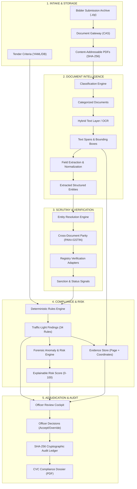

# VigilBid (SIH26100) — End-to-End System Data Flow

This document details how data moves through the VigilBid platform, from initial tender creation to final CVC compliance dossier generation. Every processing stage is mapped to its exact inputs, outputs, and responsible codebase modules.

---

## 1. High-Level Data Flow Topology

---

## 2. Stage-by-Stage Processing Breakdown

### Stage 1: Tender Ingestion & Rule Loading
- **Purpose:** Establishes the statutory criteria baseline against which all vendor bids are evaluated.
- **Input:** Tender reference code, title, category (CPCL Goods), estimated value (e.g. ₹18.40 Cr), and criteria YAML.
- **Output:** Persistent `Tender` record and associated `TenderCriterion` rows in the database.
- **Responsible Module:** `backend/services/tender_service.py` & `rules/cpcl_goods_rules.yaml`.

---

### Stage 2: Archive Ingestion & Security Screening
- **Purpose:** Safeguards the system against hostile archive exploits and fingerprints files immutably.
- **Input:** Raw multipart ZIP stream or standalone PDF file.
- **Validation Checks:**
  - Zip-bomb defense (archive size $\le 100\text{ MB}$, compression ratio $\le 100:1$, entries $\le 200$).
  - Path traversal block (no `..` or absolute paths in zip headers).
  - Magic byte inspection (`%PDF-` at byte offset 0).
- **Output:** Raw file written to Content-Addressable Storage (CAS) at `data/storage/{bidder_id}/{sha256}.pdf`.
- **Responsible Module:** `backend/services/document_service.py` & `pipeline/document_processing/ingest.py`.

---

### Stage 3: Document Typing & Classification
- **Purpose:** Identifies the statutory document type regardless of arbitrary file naming.
- **Input:** Raw text extract or first-page token distribution.
- **Classification Categories (13 Types):** GST REG-06, PAN Card, Udyam MSME Certificate, CA Audited Turnover Certificate, ITR-V Acknowledgement, OEM Authorization (Annexure-I), Integrity Pact, Land Border Rule 144(xi) Declaration, Make-in-India (PPP-MII) Local Content Declaration, EMD / Bid Security, Work Completion Certificates, Bank Solvency, and Technical Data Sheet.
- **Output:** Categorized `Document` records with classification confidence score ($\ge 0.85$).
- **Responsible Module:** `pipeline/document_processing/classifier.py`.

---

### Stage 4: Hybrid Text Layer Acquisition & OCR
- **Purpose:** Extracts readable text and character coordinates with minimal compute latency.
- **Workflow:**
  1. *Fast-Path:* PyMuPDF checks if page has native digital text ($\ge 50$ characters).
  2. *Fallback:* If scanned or stamped, rasterizes at 150/300 DPI and invokes Tesseract 5.0.
- **Output:** `TextSpan` objects with page numbers and coordinate bounding boxes `[x1, y1, x2, y2]`.
- **Responsible Module:** `pipeline/ocr/factory.py`, `pipeline/ocr/textifier.py`, and `pipeline/ocr/fallback_adapter.py`.

---

### Stage 5: Field Extraction & Format Normalization
- **Purpose:** Extracts domain-specific key-value pairs and converts them into standardized types.
- **Key Fields Extracted:** GSTIN, PAN, Legal Name, Trade Name, Constitution, Registration Date, Udyam Registration No., Enterprise Class (Micro/Small/Medium), NIC codes, 3-Year Audited Turnover, CA UDIN, OEM Validity Dates.
- **Normalization:** Indian fiscal notation (Lakhs/Crores $\rightarrow$ raw integer INR), Dates (DD/MM/YYYY $\rightarrow$ ISO-8601), Legal company suffixes (LLP $\equiv$ Limited Liability Partnership, Pvt Ltd $\equiv$ Private Limited).
- **Output:** Normalized dictionary of typed entity attributes.
- **Responsible Module:** `pipeline/extraction/` & `pipeline/entity_resolution/normalizer.py`.

---

### Stage 6: Cross-Document Entity Resolution
- **Purpose:** Detects whether all submitted documents genuinely belong to the same commercial entity.
- **Algorithmic Checks:**
  1. Sub-string PAN containment: Verifies characters 3–12 of GSTIN match the PAN card.
  2. Jaro-Winkler string similarity: Checks legal name parity across certificates (threshold $\ge 0.85$).
  3. Address token similarity: Flags discrepancies across GST and MSME locations.
- **Output:** `EntityResolutionResult` with confidence score and conflict flags.
- **Responsible Module:** `pipeline/entity_resolution/matcher.py` & `pipeline/entity_resolution/validators.py`.

---

### Stage 7: Government Registry Verification
- **Purpose:** Simulates live verification against statutory Government of India registries.
- **Registries Queried:**
  - GSTN Common Portal: Returns filing status (`Active`, `Cancelled`, `Suspended`).
  - Income Tax / CBDT: Verifies PAN status and linkage.
  - MCA-21: Verifies corporate incorporation and director master data.
  - Udyam MSME Portal: Validates enterprise category and NIC eligibility.
  - CVC / CPPP Debarment Registry: Checks central vigilance blacklists.
- **Output:** `VerificationRecord` rows linked to the bidder profile.
- **Responsible Module:** `pipeline/registry_adapters/mock_adapter.py` (adhering to official schemas).

---

### Stage 8: Deterministic Rule Engine Evaluation
- **Purpose:** Executes statutory eligibility checks deterministically under GFR 2017 and CPCL rules.
- **Rule Set:** 34 CPCL Goods rules evaluated against extracted fields and registry records.
- **Status Outcomes:** `PASS` (Compliant), `WARN` (Non-critical variance), `REVIEW` (Officer clarification required), `FAIL` (Hard statutory breach).
- **Output:** `Finding` records containing rule ID, legal clause citation, status, and summary reason.
- **Responsible Module:** `pipeline/compliance/engine.py` & `pipeline/compliance/cross_verifier.py`.

---

### Stage 9: Forensic Anomaly Detection & Risk Scoring
- **Purpose:** Uncovers document tampering, hidden collusion, and calculates explainable risk scores.
- **Forensic Checks:**
  - PDF modification timestamps post-dating creation timestamps (e.g. GIMP 2.10 edits).
  - Adversarial prompt injection tokens in bid text.
  - Cross-bidder collusion links (shared authors, MAC addresses, bank accounts).
- **Risk Score:** 0–100 weighted index decomposed into Identity (30%), Financial (25%), Compliance (25%), and Anomaly (20%) drivers.
- **Output:** `RiskAssessment` record with itemized mathematical driver breakdown.
- **Responsible Module:** `pipeline/risk/anomaly.py`, `pipeline/risk/scorer.py`, and `pipeline/risk/graph.py`.

---

### Stage 10: Evidence Storage & Linking
- **Purpose:** Binds every compliance finding to verifiable, visual source evidence.
- **Output:** `Evidence` records storing `document_id`, `page_number`, `bounding_box` coordinates `[x1, y1, x2, y2]`, and verbatim text snippets.
- **Responsible Module:** `backend/models/evidence.py` & `pipeline/evidence/highlighter.py`.

---

### Stage 11: Human-in-the-Loop Adjudication & Audit Sealing
- **Purpose:** Human procurement officer reviews findings, adjudicates edge cases, and seals decisions.
- **Officer Actions:**
  - `Accept`: Concur with system finding.
  - `Override`: Change finding status (MANDATES entering a reasoned textual justification).
  - `Seek Clarification`: Generate official inquiry notice.
- **Audit Chaining:** All actions hashed via forward SHA-256 link:
  $$H_n = \text{SHA-256}(H_{n-1} \,\|\, \text{Timestamp} \,\|\, \text{User} \,\|\, \text{Action} \,\|\, \text{Payload})$$
- **Output:** Immutable `AuditLog` entry and generated CVC Compliance Dossier PDF.
- **Responsible Module:** `backend/services/audit_service.py`, `pipeline/audit/hasher.py`, and `pipeline/reports/dossier.py`.
